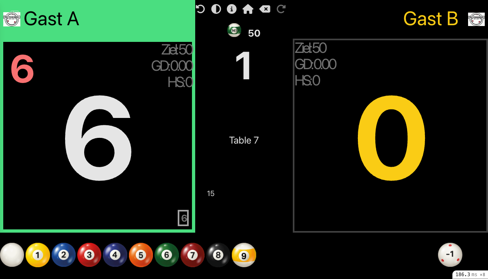
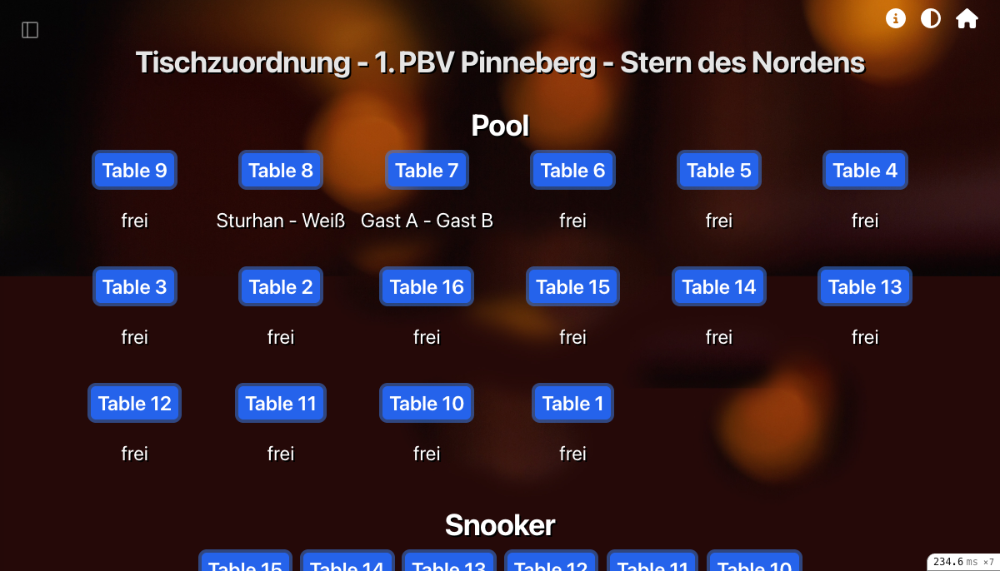

# Carambus

**Open-source tournament & club management for billiards — carom, pool, and snooker.**

🇩🇪 Auf Deutsch lesen: [docs/README.de.md](docs/README.de.md)

Carambus runs the day-to-day of a billiards club or federation: live scoreboards at the tables, complete tournament and league management, bidirectional synchronization with ClubCloud (the German Billiards Union platform), and an AI chat assistant that helps tournament directors handle registrations and league operations. It has been in production at Billardclub Wedel 61 e.V. since 2022.

## Screenshots

## Features

- **Real-time scoreboards** — touch-operated table scoreboards with live updates (Hotwire/Turbo, StimulusReflex, Action Cable)
- **Tournament & league management** — from seeding and group draws to game protocols and result PDFs
- **Bidirectional ClubCloud (DBU) sync** — registrations, rosters, and results flow between Carambus and the federation platform
- **AI chat assistant** — MCP-based tools let tournament directors manage registrations and league days conversationally
- **Scenario-based multi-tenant deployment** — one central API server plus lightweight local club servers, Raspberry Pi supported

Full feature documentation lives on the docs site: **https://GernotUllrich.github.io/carambus**

## Architecture

A central API server (api.carambus.de) holds the shared data — players, clubs, tournaments, leagues — and local club servers sync from it; the `LocalProtector` concern guards globally synced records against local modification. The central database currently spans 17 seasons with about 66,860 players, 313,509 games, and 18,384 tournaments.

**Tech stack:** Rails 7.2, Ruby 3.2, PostgreSQL, Redis, Hotwire/Turbo + StimulusReflex + Action Cable.

## Getting started

- **Run it / deploy it:** see the [documentation site](https://GernotUllrich.github.io/carambus) for installation guides (including Raspberry Pi).
- **Develop on it:** see [CONTRIBUTING.md](CONTRIBUTING.md) for local development setup, tests, and linting.

## Contributing

Contributions are welcome — see [CONTRIBUTING.md](CONTRIBUTING.md).

## License

[MIT](LICENSE)
