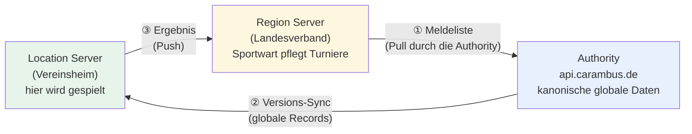

# CC-loses Turniermanagement

Wie Carambus Einzelmeisterschaften **ohne ClubCloud** trägt: welche Instanz welche Rolle hat, wie
die Daten zwischen ihnen fließen, was konfiguriert sein muss — und wie man prüft, ob es stimmt.

!!! info "CC-los ≠ CC-frei"
    Entkoppelt wird nur der **Turnier-Lebenszyklus**: Anlage, Meldeliste, Durchführung, Ergebnis.
    **Vereine und Spieler bleiben über die DBU-ClubCloud gepflegt** — die Landesverbände sind
    DBU-Mitglieder. Der Ingest legt deshalb **niemals** Spieler an; er löst sie über die `dbu_nr`
    auf und meldet, was er nicht zuordnen kann.

## Die drei Rollen



| Rolle | Erkennungsmerkmal in der Config | Aufgabe |
|---|---|---|
| **Authority** | `cap_role: api`, `carambus_api_url` **leer** | hält die globalen Records, **holt** Meldelisten, verteilt per Sync |
| **Region Server** | `carambus_api_url` gesetzt, **kein** `location_id` | Sportwart legt Turniere an und pflegt die Meldeliste (lokale Records) |
| **Location Server** | `carambus_api_url` gesetzt **und** `location_id` | hier wird gespielt; hier entsteht das Ergebnis |

**Zwei lokale Server syncen nie miteinander.** Jeder Weg führt über die Authority. Der einzige
direkte Draht ist ③ — der Location Server meldet sein Ergebnis an den Region Server zurück.

## Der Datenfluss im Einzelnen

### ① Meldeliste: Pull durch die Authority

Der Sportwart legt Turnier und Meldeliste auf dem **Region Server** an — dort sind es **lokale**
Records (`id >= 50.000.000`). Die Authority holt sie aktiv ab:

```bash
# auf der Authority
bin/rails region_server:import_entry_lists REGION=TBV SEASON=2026/2027            # dry-run
ARMED=1 bin/rails region_server:import_entry_lists REGION=TBV SEASON=2026/2027    # schreibt
```

Der Endpunkt `GET /api/entry_lists` auf dem Region Server liefert dabei **ausschließlich lokale**
Turniere aus. Das ist kein Detail, sondern ein Schutz: ohne diesen Filter würde die Authority von
einem aus der ClubCloud gescrapten Turnier einen **globalen Zwilling** anlegen und per Sync
verteilen.

### ② Verteilung: der reguläre Versions-Sync

Nach dem Ingest ist das Turnier ein **globaler** Record (`id < 50.000.000`) und wandert über den
normalen PaperTrail-Versions-Sync an alle Instanzen — auch an den Location Server, wo gespielt wird.

Der Spielort reist mit: `location_id` steht in `Tournament::SeasonCopier::STRUCTURE_ATTRIBUTES`, und
`Location`-IDs sind global, also auf allen Instanzen identisch.

### ③ Ergebnis: Push an den Region Server

Beim Turnier-Abschluss laufen auf dem Location Server automatisch und **fehlertolerant** zwei Dinge
(ein Fehler dort blockiert den Abschluss nicht):

1. `Tournament::FinalRankingWriter` schreibt die Gesamtrangliste nach `seeding.data["result"]` und
   markiert sie mit `data["result_source"] = "carambus"`.
2. `LocationServer::ResultReporter` meldet sie per `POST /api/tournament_results` an den Region Server.

Nachträglich (z. B. wenn im Vereinsheim das Netz weg war):

```bash
bin/rails tournaments:report_results TOURNAMENT=<ID>            # dry-run
ARMED=1 bin/rails tournaments:report_results TOURNAMENT=<ID>
```

Von dort holt **derselbe Ingest wie in ①** das Ergebnis auf die Authority: der Endpunkt hängt eine
vorhandene `Gesamtrangliste` an den Eintrag an.

## Die ID-Übersetzung: `source_url`

Der Kern des Ganzen — und der Grund, warum keine Migration nötig war.

Dasselbe Turnier hat auf dem Region Server eine **lokale**, auf der Authority eine **globale** ID.
Verknüpft werden beide über ein Feld, das es längst gab:

```
source_url = "https://tbv.carambus.de/tournaments/<lokale-id>"
```

- Beim Ingest **schreibt** die Authority dieses Feld; es ist zugleich ihr Idempotenz-Schlüssel
  (`Tournament.find_by(source_url:)`).
- Beim Ergebnis-Push **liest** der `ResultReporter` daraus Zieladresse *und* Ziel-ID zurück.

**Ohne `source_url` gibt es keinen Rückweg.** Meldet der Reporter „kein source_url, nichts zu
melden", ist das Turnier nicht über den Ingest entstanden.

## Konfiguration

Drei Ebenen, in dieser Reihenfolge. Die Zugangsdaten werden **generiert, nicht von Hand gepflegt** —
sonst fehlen sie auf jeder neu aufgesetzten Instanz.

### 1. Deklaration — `carambus_data/scenarios/<name>/config.yml`

```yaml
scenario:
  context: TBV               # Region-Shortname dieser Instanz
  location_id: 2426          # nur Location Server
  credentials:
    features: [ai, translation]        # ohne `clubcloud` = CC-lose Region
    region_server_contexts: [TBV]      # LISTE — die Authority holt von mehreren
```

**Wer braucht `region_server_contexts`?**

| Instanz | braucht ihn? | warum |
|---|---|---|
| Authority | **ja**, für jeden CC-losen Region Server | sie holt dort die Meldelisten |
| Location Server in CC-**loser** Region | **ja** | er meldet den Abschluss direkt |
| Location Server in Region **mit** ClubCloud | nein | der Rückweg läuft über die CC |
| Region Server | nein | er ist Ziel, nicht Aufrufer |

Das Feature `clubcloud` ist der Diskriminator: es sagt aus, ob die Region ihren Turnier-Lebenszyklus
noch über die ClubCloud fährt.

### 2. Der Secret-Pool — `carambus_data/secrets.yml`

Gitignored, `chmod 600`, **eine** Datei für alle Szenarien:

```yaml
shared:
  region_server:
    tbv:                     # Kontext KLEINGESCHRIEBEN (Code: shortname.downcase)
      username: carambus-app-tbv-bridge@carambus.de
      password: "<einmalig angezeigtes Passwort>"
```

!!! warning "Fehlt der Eintrag, lässt der Generator die Gruppe **still** weg"
    Kein Fehler, keine Warnung — die Instanz läuft und scheitert erst beim ersten Aufruf.
    `bin/rails doctor:scenarios` findet genau das.

### 3. Ausrollen — verschlüsselte Credentials

```bash
rake "scenario:generate_credentials[carambus_api,production]"                 # DRY-RUN
WRITE=true rake "scenario:generate_credentials[carambus_api,production]"
rake "scenario:push_credentials[carambus_api]"                                # DRY-RUN
WRITE=true RESTART=true rake "scenario:push_credentials[carambus_api]"
```

Der DRY-RUN muss `region_server.<kontext>.username` / `.password` in der Key-Struktur zeigen und
`region_server` unter den Gruppen. Auf der Instanz gegenprüfbar:

```bash
bin/rails runner 'p Carambus.region_server_credentials("TBV")&.keys'   # => [:username, :password]
```

`Carambus.region_server_credentials` liest primär die Credentials und fällt auf die flachen
`carambus.yml`-Schlüssel (`region_server_user`/`_password`) zurück — bestehende Instanzen laufen
unverändert weiter.

## Service-Accounts

**Ein Account je Region**, angelegt **auf dem Region Server**; alle Location Server dieser Region
teilen ihn.

```bash
# auf tbv.carambus.de
bin/rails "service_accounts:create_carambus_app[TBV]"
ROTATE=1 bin/rails "service_accounts:create_carambus_app[TBV]"   # neues Passwort
```

Das Passwort wird **genau einmal** ausgegeben. Danach in `secrets.yml` (Ebene 2) und neu ausrollen.

!!! danger "`Accept: application/json` ist Pflicht"
    Der `SessionsController` überspringt den CSRF-Schutz nur `if request.format.json?` — und das
    Format kommt vom **Accept**-Header, nicht vom Content-Type. Fehlt er, antwortet der Login mit
    **HTTP 422**, obwohl Benutzername und Passwort stimmen.

Gegenprobe:

```bash
curl -si https://tbv.carambus.de/login \
  -H 'Content-Type: application/json' -H 'Accept: application/json' \
  -d '{"user":{"email":"carambus-app-tbv-bridge@carambus.de","password":"<PASSWORT>"}}' \
  | grep -iE '^(HTTP|authorization)'
```

Erwartet: `HTTP/2 200` **und** eine `authorization: Bearer …`-Zeile.
Ein **401** heißt: falsches Passwort — oder der Account ist nicht bestätigt (`User` ist
`:confirmable`).

## Diagnose

Zwei Tasks, beide **strikt read-only**.

### Auf einer Instanz

```bash
bin/rails doctor:chain              # mit Login-Proben an den Gegenstellen
NETWORK=0 bin/rails doctor:chain    # ohne Netzwerk
```

Erkennt die Rolle und prüft, was für sie gilt: Auflösung des Server-Kontexts, aktuelle Saison,
Zugangsdaten, Login an den Gegenstellen, Vorhandensein der API-Endpunkte, Spielort und Tische,
Erreichbarkeit der Authority.

```
ℹ️  Rolle: Location Server (carambus_api_url=gesetzt, location_id=2426)
✅ Server-Kontext: TBV → Region TBV (id=16)
✅ Spielort: 1. Erfurter Billardclub e.V. (id=2426, 3 Tische)
✅ Rueckweg zum Region Server: Login an https://tbv.carambus.de erfolgreich
```

### Über alle Szenarien (Entwickler-Checkout)

```bash
bin/rails doctor:scenarios
```

Findet **Beziehungsfehler**, die eine einzelne Instanz nicht sehen kann:

- ein CC-loser Location Server, dessen Region Server kein Szenario hat
- ein Region Server, den die Authority **nicht** in `region_server_contexts` führt — seine
  Meldelisten werden dann nie geholt, ohne Fehlermeldung
- deklarierte Kontexte ohne Eintrag in `secrets.yml`
- nicht angepasste Szenario-Kopien (`name`/`basename`/`database_name` zeigen auf die Vorlage)

```
✅ Kette · carambus_ebc: carambus_ebc → carambus_tbv → carambus_api (TBV)
```

`bin/rails doctor` führt beides aus. Beide Tasks enden mit Exit-Code 1, wenn ein Blocker gefunden
wurde — sie lassen sich also in Skripte einbauen.

## Betrieb

| Task | Wo | Zweck |
|---|---|---|
| `tournaments:copy_season` | Region Server | Saison-Struktur aus der Vorsaison als Entwürfe |
| `region_server:import_entry_lists` | Authority | Meldelisten **und** Ergebnisse holen |
| `tournaments:report_results` | Location Server | Ergebnis nachmelden |
| `tournaments:write_final_rankings` | Region Server / Authority | Ranglisten für Alt-Turniere |
| `carambus:update_ranking_tables` | Authority | Ranglisten-Aggregation |

Alle schreibenden Tasks sind **dry-run per Default**; `ARMED=1` schaltet scharf. **Kein** Task hat
Defaults für Region oder Saison — ein implizites `current_season` hat beim ClubCloud-Rollover schon
einmal Schaden angerichtet. Der Blast-Radius steht im Task-Header und wird zur Laufzeit ausgegeben.

`carambus:update_ranking_tables` steht bewusst **nicht** im Cron.

## Bekannte Fallstricke

**Der Ingest aktualisiert bestehende Turniere nicht.**
`existing || build_tournament` — verschiebt der Sportwart nach dem ersten Ingest das Datum oder
korrigiert den Titel, erreicht das die Authority **nie, ohne Meldung**. Bis das behoben ist:
Stammdaten des Turniers vor dem ersten Ingest final machen.

**Ein leeres Ergebnis ist zweideutig.**
„0 Turniere" kann heißen: alles in Ordnung, es gibt nichts — oder: die Kette ist unterbrochen und die
Meldung wurde überlesen. Deshalb ist die **Kopfzeile** des Ingest wichtiger als die Zahlen:
`Zugang: credentials` bedeutet, der ausgerollte Weg trägt; `carambus.yml` heißt, der Fallback greift;
`—` bricht mit einer Handlungsanweisung ab.

**`Seeding#final_rank` meldet Platzierung+1** für lokal gespielte Turniere — der Sieger erscheint in
der Alt-Anzeige als Zweiter. Vorbestehend und unabhängig von v0.7; der `FinalRankingWriter` umgeht
es, indem er die 1-basierte Quelle nutzt.

**Der Server-Kontext muss zu einer Region passen.**
Wird `context` nicht aufgelöst, fällt das Scope-Band still auf den Default zurück — die Instanz zeigt
dann Daten einer **fremden** Region. `doctor:chain` prüft das als Erstes.
