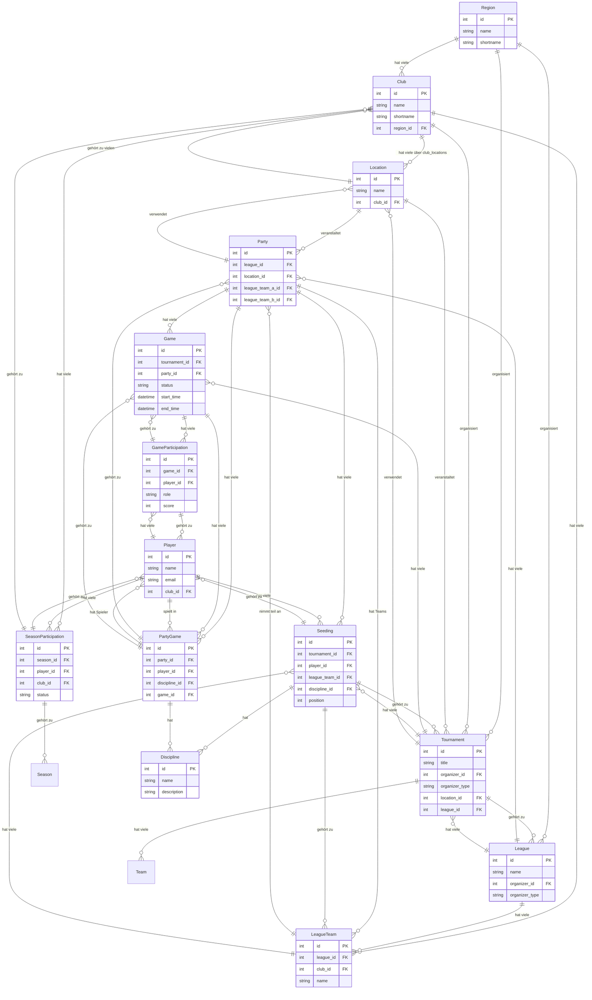

# ER-Diagramm der Carambus-Datenbank

Dieses Dokument zeigt das Entity-Relationship-Diagramm der Carambus-Datenbankstruktur.

## Übersicht

Das ER-Diagramm zeigt die Beziehungen zwischen den wichtigsten Entitäten im Carambus-System:
- **Regionen** organisieren Vereine, Turniere und Ligen
- **Vereine** haben Standorte und organisieren Turniere
- **Turniere** werden an Standorten ausgetragen und gehören zu Ligen
- **Ligen** haben Spieltage (Parties) und Teams
- **Spieltage** bestehen aus Spielen zwischen Teams
- **Spiele** werden von Spielern bestritten

## Vollständiges ER-Diagramm



## Beziehungsarten

### 1:1 (Eins-zu-Eins)
- **Ein Spieler** hat **eine E-Mail-Adresse**
- **Ein Spiel** hat **einen Status**

### 1:N (Eins-zu-Viele)
- **Eine Region** hat **viele Vereine**
- **Ein Verein** hat **viele Standorte**
- **Ein Turnier** hat **viele Spiele**

### N:M (Viele-zu-Viele)
- **Vereine** haben **viele Standorte** über `club_locations`
- **Spieler** spielen in **vielen Spielen** über `game_participations`
- **Spiele** gehören zu **vielen Spieltagen** über `party_games`

## Schlüsselattribute

### Primärschlüssel (PK)
- `id`: Eindeutige Identifikation jeder Entität
- Auto-increment Integer-Werte

### Fremdschlüssel (FK)
- `region_id`: Verweis auf die übergeordnete Region
- `club_id`: Verweis auf den zugehörigen Verein
- `tournament_id`: Verweis auf das Turnier
- `league_id`: Verweis auf die Liga
- `location_id`: Verweis auf den Standort
- `player_id`: Verweis auf den Spieler

## Datenintegrität

### Referentielle Integrität
- Alle Fremdschlüssel verweisen auf gültige Primärschlüssel
- CASCADE-Löschungen für abhängige Datensätze
- RESTRICT-Löschungen für kritische Beziehungen

### Geschäftsregeln
- Ein Spieler kann nur in einem Verein pro Saison sein
- Ein Turnier kann nur an einem Standort stattfinden
- Ein Spieltag gehört zu genau einer Liga

## Erweiterte Beziehungen

### Polymorphe Beziehungen
```ruby
# Tournament kann von Region oder Club organisiert werden
belongs_to :organizer, polymorphic: true

# Verwendung
tournament.organizer_type # "Region" oder "Club"
tournament.organizer_id   # ID der organiserenden Entität
```

### Durchgangstabellen
```ruby
# club_locations verbindet Clubs und Locations
class ClubLocation < ApplicationRecord
  belongs_to :club
  belongs_to :location
end
```

## Performance-Optimierungen

### Indizes
- Alle Fremdschlüssel sind indiziert
- Zusammengesetzte Indizes für häufige Abfragen
- Unique-Indizes für Geschäftsregeln

### Abfrageoptimierung
- Eager Loading für N+1-Problem vermeiden
- Scopes für häufige Filter
- Counter Caches für Zählungen

## Datenmodell-Änderungen

### Migrationen
```bash
# Neue Tabelle erstellen
rails generate migration CreateNewTable

# Spalte hinzufügen
rails generate migration AddColumnToTable

# Migration ausführen
rails db:migrate
```

### Rollback
```bash
# Letzte Migration rückgängig machen
rails db:rollback

# Zu bestimmter Version zurückkehren
rails db:migrate VERSION=20231201000000
```

## Monitoring und Wartung

### Datenbankgröße
- Regelmäßige Überprüfung der Tabellengrößen
- Archivierung alter Daten
- Cleanup von gelöschten Datensätzen

### Performance-Überwachung
- Langsame Abfragen identifizieren
- Indizes optimieren
- Query-Pläne analysieren

## Best Practices

### Modellierung
- **Normalisierung**: Vermeiden Sie Redundanz
- **Denormalisierung**: Für Performance bei Bedarf
- **Konsistenz**: Einheitliche Namenskonventionen

### Entwicklung
- **Migrationen**: Immer reversibel gestalten
- **Validierungen**: Auf Modell- und Datenbankebene
- **Tests**: Datenbanklogik testen

### Wartung
- **Backups**: Regelmäßige Sicherungen
- **Updates**: Datenbank-Updates planen
- **Monitoring**: Performance kontinuierlich überwachen 