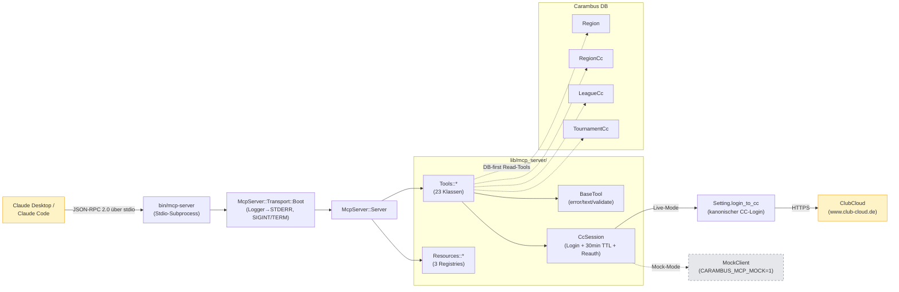
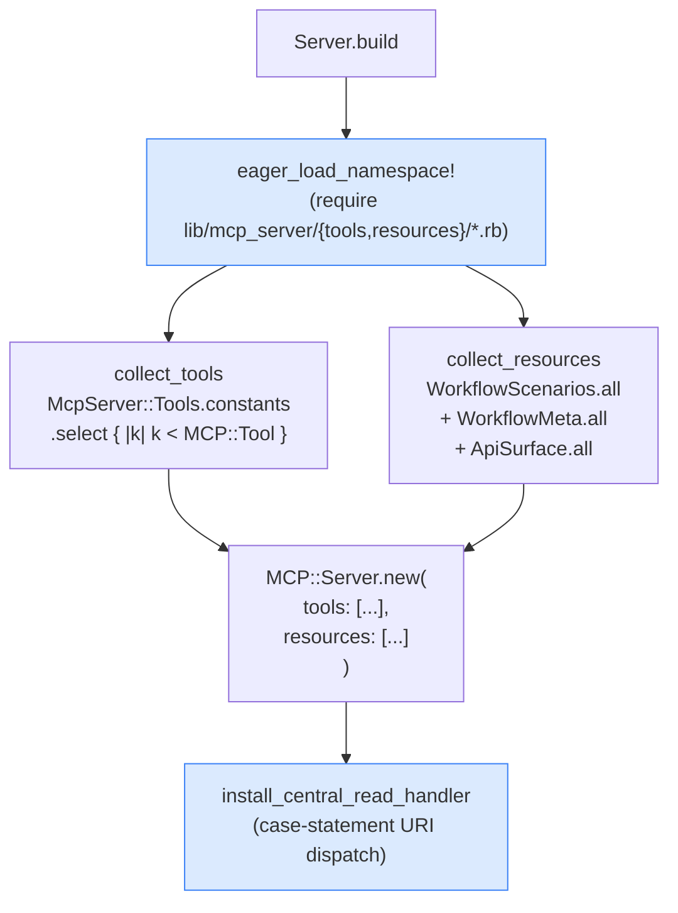
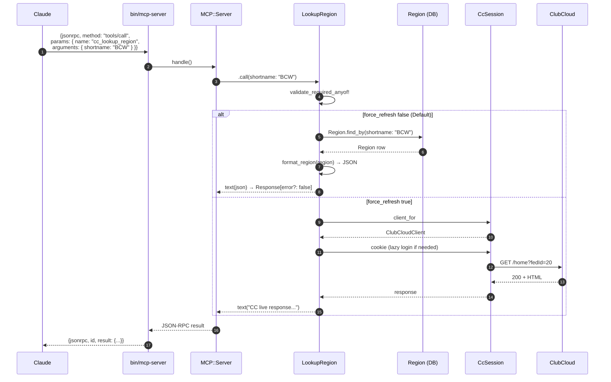
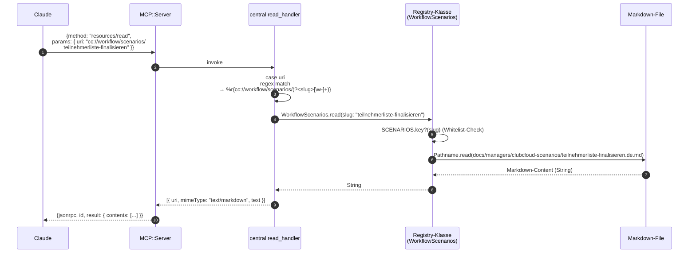
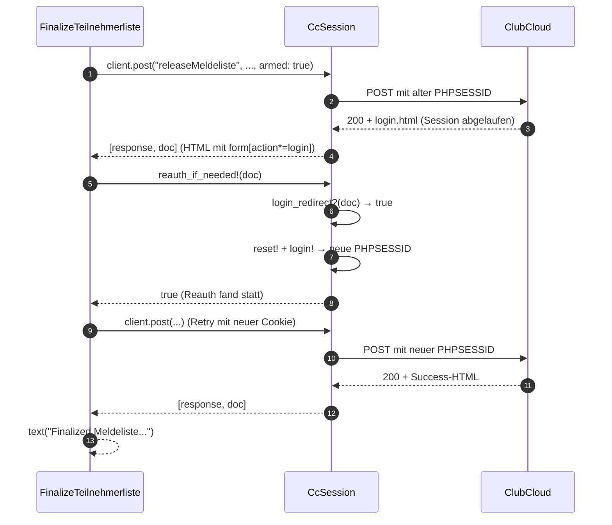

# ClubCloud MCP-Server — Entwickler-Handbuch

> **Zielgruppe:** Carambus-Entwickler. Deckt Onboarding, Erweiterung (Phase 40.1+), Operations/Debugging und API-Referenz ab.
> **Setup-Quickstart für Sportwarte/Endanwender:** [`docs/managers/clubcloud-mcp-cloud-quickstart.de.md`](../managers/clubcloud-mcp-cloud-quickstart.de.md) (User-facing)
> **Per-Region-Admin-Setup:** [`docs/managers/clubcloud-mcp-setup-service.de.md`](../managers/clubcloud-mcp-setup-service.de.md) (Carambus-Tech-Admin)
> **Stand:** Phase 40 abgeschlossen 2026-05-07. Phase 40.1 in Vorbereitung.

---

## Inhaltsverzeichnis

1. [Was ist der MCP-Server?](#1-was-ist-der-mcp-server)
2. [Architektur-Übersicht](#2-architektur-ubersicht)
3. [Datenfluss](#3-datenfluss)
4. [Datei-Layout](#4-datei-layout)
5. [Setup für Entwickler](#5-setup-fur-entwickler)
6. [Reference Manual](#6-reference-manual)
7. [How-To: Erweitern](#7-how-to-erweitern)
8. [Tests](#8-tests)
9. [Debugging-Cookbook](#9-debugging-cookbook)
10. [Pitfalls](#10-pitfalls)
11. [Bekannte Issues (Code-Review-Findings)](#11-bekannte-issues-code-review-findings)
12. [Phase 40.1 Roadmap](#12-phase-401-roadmap)

---

## 1. Was ist der MCP-Server?

### Model Context Protocol — der Begriff

Das **Model Context Protocol (MCP)** ist eine offene Spezifikation von Anthropic, die KI-Clients (Claude Desktop, Claude Code) erlaubt, mit lokalen oder remote Servern über JSON-RPC 2.0 zu kommunizieren. Ein MCP-Server stellt zwei Arten von Endpunkten bereit:

- **Tools** — Operationen, die der KI-Client aufrufen kann (`tools/call`). Können lesen oder schreiben.
- **Resources** — adressierbare Dokumente unter `cc://`-URIs (`resources/read`). Strikt lesend.

Claude entscheidet anhand der Konversation, welches Tool/Resource es konsultiert. Der Server sieht nur einzelne JSON-RPC-Calls — keinen Konversationsverlauf.

### Warum Carambus einen MCP-Server hat

Vor Phase 40 war ClubCloud-Wissen für KI-Assistenten unzugänglich:

- **Sportwart fragt Claude Desktop:** "Wie finalisiere ich die Teilnehmerliste in ClubCloud?" → Claude antwortet aus Trainingsdaten oder halluziniert.
- **Carambus-Dev fragt Claude Code:** "Welche `RegionCc::ClubCloudClient.PATH_MAP`-Action releaset eine Meldeliste?" → Claude muss durch die ganze Codebase grepen.
- **Operative Aktion:** "Release Meldeliste 12345 für BCW Karambol Saison 2025/2026" → kein direkter Pfad.

Phase 40 schließt alle drei Lücken in einem Server: vier Schichten ClubCloud-Wissen, exponiert über Stdio-Subprocess.

### Die vier Schichten

| Schicht | URI / Tool-Präfix | Anzahl | Zielgruppe |
|---------|-------------------|--------|------------|
| **Workflow-Doku (DE)** | `cc://workflow/scenarios/*` + `cc://workflow/{roles,glossary}` | 5 Resources | Sportwart |
| **API-Surface (curated)** | `cc://api/{action}` | 15 Resources | Carambus-Dev |
| **Read-Tools (Lookup)** | `cc_whoami` + `cc_lookup_*` + `cc_list_*` + `cc_search_*` + `cc_check_*` | 17 Tools | beide |
| **Write-Tools (Mutation)** | `cc_register_*` / `cc_unregister_*` / `cc_*_teilnehmerliste` / `cc_update_tournament_deadline` | 6 Tools | Sportwart |

---

## 2. Architektur-Übersicht

### System-Komponenten



### Auto-Registry-Mechanismus

Der Server nutzt **Konstanten-Enumeration**, um Tools und Resources zu finden — kein manuelles Registrieren pro neuer Klasse:



**Konsequenz:** Eine neue Tool-Klasse unter `lib/mcp_server/tools/` (Subklasse von `McpServer::Tools::BaseTool`) wird beim nächsten Server-Boot automatisch entdeckt — kein Edit von `server.rb` nötig.

**Ein einziger zentraler `resources_read_handler`** dispatched alle `cc://`-URIs per Regex an die richtige Registry-Klasse (`WorkflowScenarios.read`, `WorkflowMeta.read`, `ApiSurface.read`). Das verhindert SDK-Konflikte (das MCP-SDK akzeptiert nur einen Handler pro Server) und macht parallele Plan-Entwicklung konfliktfrei (Phase-40-Wave-2-Lehre).

---

## 3. Datenfluss

### `tools/call` — Beispiel `cc_lookup_region` (DB-first)



### `resources/read` — zentraler Dispatcher



### Reauth-Retry — Beispiel `cc_finalize_teilnehmerliste`



---

## 4. Datei-Layout

```
lib/
├── mcp_server/
│   ├── server.rb                       # 89 LOC — Auto-Registry + zentraler read_handler
│   ├── cc_session.rb                   # 106 LOC — Login + 30min TTL + Reauth
│   ├── transport/
│   │   └── boot.rb                     # 35 LOC — Logger→STDERR, SIGINT/TERM trap, StdioTransport.open
│   ├── tools/
│   │   ├── base_tool.rb                # 43 LOC — BaseTool < MCP::Tool — error/text/validate Helpers
│   │   ├── mock_client.rb              # 42 LOC — Drop-in für CARAMBUS_MCP_MOCK=1
│   │   ├── cc_whoami.rb                             # READ — Session-Kontext (scenario/region/season/Sportwart-Scope), kein CC-Call
│   │   ├── lookup_region.rb                       # READ DB-first — kanonisches Template
│   │   ├── lookup_league.rb                        # READ DB-first
│   │   ├── lookup_tournament.rb                     # READ DB-first
│   │   ├── lookup_teilnehmerliste.rb               # READ DB-first
│   │   ├── lookup_club.rb                           # READ DB-first (cc_id ODER Name/Synonym-Suche)
│   │   ├── lookup_meldeliste_for_tournament.rb     # READ DB-first + Live-Fallback
│   │   ├── search_player.rb                         # READ DB-first (Disambiguation-Output)
│   │   ├── list_clubs_by_discipline.rb             # READ DB-first
│   │   ├── list_open_tournaments.rb                # READ DB-first
│   │   ├── list_players_by_club_and_discipline.rb  # READ DB-first
│   │   ├── list_players_by_name.rb                  # READ DB-first (kein CC-Call)
│   │   ├── check_player_discipline_experience.rb   # READ DB-first
│   │   ├── lookup_team.rb                           # READ live-only
│   │   ├── lookup_spielbericht.rb                  # READ live-only
│   │   ├── lookup_category.rb                       # READ live-only
│   │   ├── lookup_serie.rb                          # READ live-only
│   │   ├── finalize_teilnehmerliste.rb             # WRITE — armed-flag + parse_cc_error + Reauth-Retry
│   │   ├── assign_player_to_teilnehmerliste.rb     # WRITE
│   │   ├── remove_from_teilnehmerliste.rb          # WRITE
│   │   ├── register_for_tournament.rb              # WRITE
│   │   ├── unregister_for_tournament.rb            # WRITE
│   │   └── update_tournament_deadline.rb           # WRITE
│   └── resources/
│       ├── workflow_scenarios.rb       # cc://workflow/scenarios/* (3 Slugs whitelisted)
│       ├── workflow_meta.rb            # cc://workflow/{roles,glossary}
│       └── api_surface.rb              # cc://api/{action} (15 ALLOWLIST entries)
bin/
└── mcp-server                          # 0755 — require config/environment + Boot.run

docs/
├── managers/
│   ├── clubcloud-mcp-setup.de.md       # Sportwart-Setup-Quickstart
│   └── clubcloud-scenarios/
│       ├── teilnehmerliste-finalisieren.de.md
│       ├── player-anlegen.de.md
│       ├── endrangliste-eintragen.de.md
│       ├── cc-roles.de.md
│       └── cc-glossary.de.md
└── developers/
    └── clubcloud-mcp-server.de.md      # ← diese Datei

test/mcp_server/
├── server_smoke_test.rb                # 6 Tests — Auto-Registry + Boot
├── cc_session_test.rb                  # 8 Tests — Login + TTL + Reauth + Mock-Failsafe
├── resources/
│   ├── workflow_scenarios_test.rb
│   ├── workflow_meta_test.rb
│   └── api_surface_test.rb             # inkl. PATH_MAP-Drift-Guard
├── tools/
│   ├── lookup_region_test.rb           # DB-first acceptance
│   ├── lookup_teilnehmerliste_test.rb  # D-18 acceptance story
│   ├── search_player_test.rb           # live-only
│   ├── finalize_teilnehmerliste_test.rb # 6 Tests inkl. Reauth-Retry
│   └── lookup_smoke_test.rb            # Tool-Namen Drift-Detection (EXPECTED_TOOL_NAMES, 23 Tools inkl. cc_whoami)
└── integration/
    └── stdio_e2e_test.rb               # 6 E2E — bin/mcp-server Subprocess + JSON-RPC

lib/capistrano/tasks/
└── mcp_server.rake                     # chmod 0755 bin/mcp-server nach bundle:install

.mcp.json.example                       # Vorlage — .mcp.json ist gitignored
```

**Gesamt:** 31 Source-Files, ~1100 LOC Production-Code, 65 Tests / 220 Assertions.

---

## 5. Setup für Entwickler

### Mock-Mode (kein CC-Account nötig)

Erste Wahl für lokales Hacking — keine Live-Calls, keine Credentials.

```bash
DOCS_AUTO_REBUILD=0 CARAMBUS_MCP_MOCK=1 RAILS_ENV=development bin/mcp-server
```

`MockClient` antwortet mit Stub-Responses. `cc_finalize_teilnehmerliste` mit `armed: false` ist eine Dry-Run-Probe (gibt `"Would finalize ..."` zurück) — das funktioniert auch ohne Mock-Flag.

### Live-Mode

```bash
CC_REGION=NBV RAILS_ENV=development bin/mcp-server
```

`CcSession` delegiert den Login an `Setting.login_to_cc` — der kanonische CC-Login-Flow inklusive
`call_police`-Hidden-Field, MD5-Passwort und PHPSESSID-Extraction. Phase 40 rollt **kein** eigenes
`Net::HTTP::Post` (extend-before-build).

Credentials werden ausschließlich aus **Rails Credentials** geladen (siehe Sub-Sektion unten).
ENV-Vars `CC_USERNAME`/`CC_PASSWORD`/`CC_FED_ID` werden seit Quick-Task `260507-njl` nicht mehr gelesen —
`CC_REGION` (Shortname, z.B. `NBV`) reicht aus, um Region + `fed_id` (= `region_cc.cc_id`) automatisch zu ermitteln.
`CC_FED_ID` bleibt als optionaler Override für Edge-Cases (z.B. Test-Fixtures ohne Region-Eintrag).

### Rails Credentials Setup (für lokales Live-Debug)

Auf Production-Servern (z.B. `carambus_bcw`) sind CC-Credentials bereits in
`config/credentials/production.yml.enc` konfiguriert. Für lokales Live-Debug auf dem Dev-Mac:

```bash
EDITOR=vi bundle exec rails credentials:edit --environment development
```

YAML-Struktur (per-Region-Kontext):

```yaml
clubcloud:
  nbv:
    username: dein@email.de
    password: dein-cc-passwort
  bcw:
    username: anderer@email.de
    password: anderes-passwort
```

`Setting.get_cc_credentials(context)` liest den Block für den passenden Region-Shortname.
`CC_REGION` (oder `Setting.key_get_value("context")`) entscheidet, welcher Block geladen wird.

**Wichtig:** Die per-environment-Trennung bedeutet — Credentials müssen sowohl in `development.yml.enc`
(für lokales `bin/mcp-server`) als auch in `production.yml.enc` (für Production-Deployments) hinterlegt sein.
Ohne passenden Block: `RuntimeError "ClubCloud username not configured for region: <SHORTNAME>"` aus
`Setting.login_to_cc`.

### Claude Code (Project-Scope) einbinden

Empfohlen für Carambus-Dev-Workflow:

```bash
cp .mcp.json.example .mcp.json
$EDITOR .mcp.json   # CC_REGION ggf. anpassen
```

`.mcp.json` ist gitignored. Claude Code löst `${VAR}`-Expansion beim Server-Start auf:

```json
{
  "mcpServers": {
    "carambus_clubcloud": {
      "command": "/abs/path/to/carambus_api/bin/mcp-server",
      "args": [],
      "env": {
        "RAILS_ENV": "development",
        "CC_REGION": "${CC_REGION:-NBV}",
        "CARAMBUS_MCP_MOCK": "${CARAMBUS_MCP_MOCK:-0}"
      }
    }
  }
}
```

### Claude Desktop (User-Scope) einbinden

Einmalige Konfiguration für alle Projekte:

```bash
claude mcp add carambus_clubcloud \
  --scope user \
  --command /abs/path/to/carambus_api/bin/mcp-server \
  --env CC_REGION=NBV \
  --env RAILS_ENV=development
```

Schreibt nach `~/.claude.json`. Vorteil: überall verfügbar. Credentials liegen separat in Rails Credentials — kein Klartext im Home-Dir.

### Manueller JSON-RPC-Test

```bash
echo '{"jsonrpc":"2.0","id":1,"method":"initialize","params":{"protocolVersion":"2024-11-05","capabilities":{},"clientInfo":{"name":"test","version":"1.0"}}}' | \
  CARAMBUS_MCP_MOCK=1 RAILS_ENV=development bin/mcp-server | grep '^{' | jq .
```

Erwartete Antwort: JSON mit `result.serverInfo.name = "carambus_clubcloud"`.

---

## 6. Reference Manual

### `McpServer::Server` (`lib/mcp_server/server.rb`)

Wiring-Klasse. Stateless — alle Methoden sind class-level.

| Methode | Signatur | Zweck |
|---------|----------|-------|
| `.build` | → `MCP::Server` | Liefert vollständig wired Server. Eager-loadet Namespaces, sammelt Tools + Resources, installiert zentralen Read-Handler. |
| `.collect_tools` | → `Array<Class>` | Enumeriert `McpServer::Tools.constants`, filtert auf Subklassen von `MCP::Tool`. |
| `.collect_resources` | → `Array<MCP::Resource>` | Konkateniert `.all` von WorkflowScenarios + WorkflowMeta + ApiSurface. |
| `.install_central_read_handler` | `(server)` → void | Registriert die einzige `resources_read_handler`-Closure mit Regex-URI-Dispatch. |
| `.eager_load_namespace!` | → void | Force-loaded `lib/mcp_server/{tools,resources}/*.rb`, damit `.constants` vollständig ist. |

**Konstante:** `SERVER_NAME = "carambus_clubcloud"` — wird beim `initialize`-Handshake an Claude zurückgegeben.

### `McpServer::CcSession` (`lib/mcp_server/cc_session.rb`)

Singleton via Class-Level-State. Single-threaded by design — MCP stdio ist one-request-at-a-time.

| Methode | Signatur | Zweck |
|---------|----------|-------|
| `.client_for` | `(_server_context = nil)` → `ClubCloudClient` oder `MockClient` | Liefert den richtigen HTTP-Client. Wirft `RuntimeError` wenn `mock_mode? && Rails.env.production?`. |
| `.cookie` | → `String` | Lazy-Login. Gibt aktive PHPSESSID zurück, loggt ein wenn Cache leer/abgelaufen. |
| `.cookie_expired?` | `(started_at)` → `Boolean` | True wenn `Time.now - started_at > 30.minutes`. |
| `.reset!` | → void | Setzt `session_id` + `session_started_at` auf nil. |
| `.mock_mode?` | → `Boolean` | True wenn `ENV["CARAMBUS_MCP_MOCK"] == "1"`. |
| `.reauth_if_needed!` | `(doc)` → `Boolean` | Erkennt Login-Redirect in HTML-Doc; falls erkannt: `reset!` + `cookie`. Gibt `true` zurück wenn Reauth stattfand (Tool soll dann Call wiederholen). |

**Konstanten:** `TTL_SECONDS = 30 * 60`, `MOCK_FLAG = "CARAMBUS_MCP_MOCK"`.

**Class-Attrs:** `session_id`, `session_started_at`, `_client_override` (Test-Hook).

### `McpServer::Tools::BaseTool` (`lib/mcp_server/tools/base_tool.rb`)

Subklasse von `MCP::Tool`. Alle eigenen Tool-Klassen erben von `BaseTool`.

| Methode | Signatur | Zweck |
|---------|----------|-------|
| `.error` | `(message)` → `MCP::Tool::Response` | Fehler-Response (`error: true`). |
| `.text` | `(message)` → `MCP::Tool::Response` | Erfolgs-Response. |
| `.validate_required!` | `(args, required_keys)` → `nil` oder `Response` | Manuelle Required-Validation. Gibt `nil` zurück wenn alle Keys gesetzt, sonst Error-Response. |
| `.mock_mode?` | → `Boolean` | True wenn `CARAMBUS_MCP_MOCK=1`. |
| `.cc_session` | → `Class` | Convenience: gibt `McpServer::CcSession` zurück. |
| `.default_fed_id` | → `Integer` oder `nil` | Liefert die ClubCloud `fed_id` mit Priorität: (1) ENV `CC_FED_ID` (Override), (2) Region-Lookup via `Region.find_by(shortname: CC_REGION).region_cc.cc_id` (kanonisch — ENV `CC_REGION` oder `Setting.key_get_value("context")`, Default `NBV`), (3) `nil`. Defensives `rescue StandardError` schützt Mock-Smoke-Tests ohne DB. Tools nutzen `fed_id \|\|= default_fed_id` vor der Validierung. Geändert in Quick-Task `260507-njl` — vorher reiner ENV-Lookup. |

**Wichtig:** `MCP::Tool#input_schema` ist deskriptiv (für Claudes Toolauswahl), **nicht** Runtime-Validation. Manuelle Validierung im Tool-Body ist Pflicht.

### Resource-Klassen-Pattern

Alle drei Resource-Klassen (`WorkflowScenarios`, `WorkflowMeta`, `ApiSurface`) folgen demselben Vertrag:

| Methode | Signatur | Zweck |
|---------|----------|-------|
| `.all` | → `Array<MCP::Resource>` | Liste aller exponierten Resources mit URI, Name, Title, Description, Mime-Type. |
| `.read` | `(slug:)` oder `(key:)` oder `(action:)` → `String` | Liefert Markdown-Content. Whitelisted Slugs/Keys/Actions; Not-Found-Body bei unbekannten Werten. **Wirft niemals Exception.** |

**Sicherheits-Konvention:** Beide Lookups (Whitelist-Check + Pathname-Resolution) müssen passieren. Der zentrale Dispatcher in `Server` validiert URI-Schemes per Regex `[\w-]+` (verhindert `..`-Path-Traversal); die Registry-Klasse validiert den extrahierten Slug gegen ihre Konstante (`SCENARIOS`, `META`, `ALLOWLIST`).

### `McpServer::Tools::MockClient` (`lib/mcp_server/tools/mock_client.rb`)

Drop-in-Ersatz für `RegionCc::ClubCloudClient` im Mock-Mode.

| Methode | Signatur | Verhalten |
|---------|----------|-----------|
| `#get` | `(action, get_options, opts)` → `[response, Nokogiri-doc]` | Stub mit Code 200 + HTML `MOCK GET <action>`. |
| `#post` | `(action, post_options, opts)` → `[response, doc]` oder `[nil, nil]` | Bei `armed: false` und Write-Action: `[nil, nil]` (Dry-Run). Sonst Stub-200. |
| `#post_with_formdata` | wie `#post` | Alias. |
| `#calls` | → `Array` | Test-Hook — alle aufgezeichneten Calls als `[:get, action, opts, ...]`-Tuples. |

`writable?(action)` schlägt in `RegionCc::ClubCloudClient::PATH_MAP[action]` nach (zweiter Eintrag = `read_only?`-Boolean).

### `McpServer::Transport::Boot` (`lib/mcp_server/transport/boot.rb`)

Boot-Sequenz für `bin/mcp-server`:

1. `Rails.logger = Logger.new($stderr)` — verhindert STDOUT-Verschmutzung des JSON-RPC-Streams (Pitfall 1).
2. `$stdout.sync = true` — sofortiges Flushen für stdio-Latenz.
3. `Server.build` aufrufen.
4. Signal-Handler für SIGINT + SIGTERM registrieren — **direkter `$stderr.write`** (Pitfall 8: Logger im Trap-Kontext nicht erlaubt; Quick-Fix `260507-c4o`).
5. `MCP::Server::Transports::StdioTransport.new(server).open` — blockiert.

---

## 7. How-To: Erweitern

### 7.1 Neues Read-Tool (DB-first)

Beispiel: `cc_lookup_my_thing`. Voraussetzung: ein Carambus-Modell mit CC-Mirror existiert (z.B. `MyThingCc`).

**Schritt 1:** Neue Datei `lib/mcp_server/tools/lookup_my_thing.rb`:

```ruby
# frozen_string_literal: true

module McpServer
  module Tools
    class LookupMyThing < BaseTool
      tool_name "cc_lookup_my_thing"
      description "Look up a MyThing by id or slug. DB-first via MyThingCc; force_refresh hits CC live."
      input_schema(
        properties: {
          id:            { type: "integer", description: "MyThing id" },
          slug:          { type: "string",  description: "MyThing slug" },
          force_refresh: { type: "boolean", default: false, description: "Bypass DB cache" }
        }
      )
      annotations(read_only_hint: true, destructive_hint: false)

      def self.call(id: nil, slug: nil, force_refresh: false, server_context: nil)
        return error("Provide at least one of `id` or `slug`") if id.blank? && slug.blank?

        return live_lookup(id: id) if force_refresh

        record = id ? MyThing.find_by(id: id) : MyThing.find_by(slug: slug)
        return error("Not found in Carambus DB. Try force_refresh: true.") if record.nil?

        text(JSON.generate(id: record.id, slug: record.slug, name: record.name))
      end

      def self.live_lookup(id:)
        return error("force_refresh requires `id`") if id.blank?
        client = cc_session.client_for
        res, _doc = client.get("showMyThing", { thingId: id }, { session_id: cc_session.cookie })
        return error("CC live-lookup failed: HTTP #{res&.code}") if res&.code != "200"
        text("CC live response (id=#{id})")
      end
    end
  end
end
```

**Schritt 2:** Test unter `test/mcp_server/tools/lookup_my_thing_test.rb` (siehe [Tests](#8-tests)).

**Schritt 3:** `bin/rails test test/mcp_server/` — Smoke-Test in `lookup_smoke_test.rb` schlägt fehl bis du den neuen Tool-Namen in `EXPECTED_TOOL_NAMES` einträgst (Drift-Detection).

**Auto-Registry:** Beim nächsten Server-Boot ist `cc_lookup_my_thing` automatisch in `tools/list` enthalten — kein `server.rb`-Edit nötig.

### 7.2 Neues Read-Tool (live-only)

Wenn kein Carambus-Mirror existiert (Beispiel: `cc_lookup_team`). Schlankes Template:

```ruby
module McpServer
  module Tools
    class LookupMyThing < BaseTool
      tool_name "cc_lookup_my_thing"
      description "Live lookup of a MyThing. No Carambus mirror — always queries CC."
      input_schema(
        properties: {
          thing_id: { type: "integer", description: "CC thing ID" },
          fed_id:   { type: "integer", description: "ClubCloud federation ID" }
        }
      )
      annotations(read_only_hint: true, destructive_hint: false)

      def self.call(thing_id: nil, fed_id: nil, server_context: nil)
        return error("Missing required parameter: `thing_id`") if thing_id.blank?
        return error("Missing required parameter: `fed_id`") if fed_id.blank?

        client = cc_session.client_for
        res, _doc = client.get("showMyThing", { thingId: thing_id, fedId: fed_id },
                                { session_id: cc_session.cookie })
        return error("CC live-lookup failed: HTTP #{res&.code}") if res&.code != "200"
        text("CC live response (thing_id=#{thing_id})")
      end
    end
  end
end
```

### 7.3 Neues Write-Tool

Verbindlicher Vertrag — kopiere `finalize_teilnehmerliste.rb` als Vorlage und passe an:

**Pflicht-Bestandteile:**

1. `annotations(read_only_hint: false, destructive_hint: true)` — markiert Tool als destruktiv für Claudes UI.
2. **`armed`-Parameter** mit Default `false` — Dry-Run ist immer Standard.
3. **Allowlist-Check:** Die CC-Action MUSS in `RegionCc::ClubCloudClient::PATH_MAP` als writable (`read_only: false`) gelistet sein, sonst lehnt MockClient den Aufruf ab und Live-Mode könnte unerwartet schreiben.
4. **`parse_cc_error(doc)`** — extrahiert CC-Fehler-Divs aus der Response (D-11 trust-CC-and-parse-error).
5. **Reauth-Retry** — `cc_session.reauth_if_needed!(doc)` und einmaliger Wiederholungs-Call.
6. **Defensive Rescue:** `rescue StandardError => e ; error("Tool exception: #{e.class.name} (details suppressed...)")` — kein Stacktrace in der Response (Threat T-40-05-04).
7. **Eintrag in `ApiSurface::ALLOWLIST`** wenn die CC-Action neu ist.
8. **Eintrag in `WRAPPED_BY_TOOL`** in `api_surface.rb` für die Cross-Reference.

```ruby
def self.call(fed_id: nil, branch_id: nil, target_id: nil, armed: false, server_context: nil)
  err = validate_required!(
    { fed_id: fed_id, branch_id: branch_id, target_id: target_id },
    [:fed_id, :branch_id, :target_id]
  )
  return err if err

  client = cc_session.client_for
  res, doc = client.post(
    "doSomething",
    { branchId: branch_id, fedId: fed_id, targetId: target_id },
    { armed: armed, session_id: cc_session.cookie }
  )

  return text("Would do something with target #{target_id}.") unless armed

  return error("Unexpected nil response (armed mode).") if res.nil?

  if cc_session.reauth_if_needed!(doc)
    res, doc = client.post("doSomething", {...}, { armed: armed, session_id: cc_session.cookie })
  end

  return error("CC rejected: #{parse_cc_error(doc)} (HTTP #{res&.code})") if res&.code != "200"

  parsed = parse_cc_error(doc)
  return error("CC rejected: #{parsed}") if parsed && parsed != "(no error)"

  text("Done with target #{target_id}.")
rescue StandardError => e
  error("Tool exception: #{e.class.name} (details suppressed; check Rails.logger on stderr).")
end
```

### 7.4 Neue API-Surface-Action (`cc://api/foo`)

**Schritt 1:** Action-Name zur `ALLOWLIST`-Konstante in `lib/mcp_server/resources/api_surface.rb` hinzufügen:

```ruby
ALLOWLIST = %w[
  home
  showLeagueList
  ...
  doSomething   # NEU
].freeze
```

**Schritt 2:** Eintrag in `USED_BY_SYNCER` (welche Carambus-Service nutzt diese Action) und `WRAPPED_BY_TOOL` (welches MCP-Tool kapselt sie):

```ruby
USED_BY_SYNCER = {
  ...
  "doSomething" => "(none — Plan 40.x Write-Tool)"
}.freeze

WRAPPED_BY_TOOL = {
  ...
  "doSomething" => "cc_do_something"
}.freeze
```

**Schritt 3:** Test in `test/mcp_server/resources/api_surface_test.rb` ergänzen — der Drift-Guard (`PATH_MAP`-Existenz-Check) prüft automatisch, dass die Action in `RegionCc::ClubCloudClient::PATH_MAP` existiert.

### 7.5 Neue Workflow-Resource

Für ein neues Szenario (`cc://workflow/scenarios/my-szenario`):

**Schritt 1:** Markdown-Datei unter `docs/managers/clubcloud-scenarios/my-szenario.de.md` erstellen.

**Schritt 2:** Slug zur `SCENARIOS`-Konstante in `lib/mcp_server/resources/workflow_scenarios.rb` hinzufügen:

```ruby
SCENARIOS = {
  "teilnehmerliste-finalisieren" => "Teilnehmerliste in ClubCloud finalisieren",
  ...
  "my-szenario" => "Mein neues Szenario"
}.freeze
```

**Schritt 3:** Test in `test/mcp_server/resources/workflow_scenarios_test.rb` ergänzen.

Für eine neue Meta-Resource (`cc://workflow/foo`): analog die `META`-Konstante in `workflow_meta.rb` erweitern.

---

## 8. Tests

### Test-Schichten

| Schicht | Pfad | Was | Boot-Cost |
|---------|------|-----|-----------|
| Unit | `test/mcp_server/{tools,resources}/*_test.rb` | Einzelne Klassen, Mock-Client | schnell (< 1s) |
| Smoke | `test/mcp_server/tools/lookup_smoke_test.rb` | Drift-Detection für 23 Tool-Namen inkl. `cc_whoami` (`EXPECTED_TOOL_NAMES`) | schnell |
| Integration | `test/mcp_server/server_smoke_test.rb` | `Server.build` + Auto-Registry | schnell |
| E2E | `test/mcp_server/integration/stdio_e2e_test.rb` | echter `bin/mcp-server`-Subprocess + JSON-RPC-Roundtrip | langsam (Rails-Boot pro Test) |

### Test-Pattern für DB-first-Tool

```ruby
require "test_helper"

class LookupMyThingTest < ActiveSupport::TestCase
  test "DB-Hit liefert JSON" do
    thing = my_things(:one)   # fixture
    response = McpServer::Tools::LookupMyThing.call(slug: thing.slug)
    refute response.error?
    assert_match(/"slug":"#{thing.slug}"/, response.content.first[:text])
  end

  test "DB-Miss liefert error" do
    response = McpServer::Tools::LookupMyThing.call(slug: "nonexistent-slug")
    assert response.error?
    assert_match(/not found/i, response.content.first[:text])
  end

  test "Missing parameter liefert error" do
    response = McpServer::Tools::LookupMyThing.call
    assert response.error?
    assert_match(/Provide at least one/i, response.content.first[:text])
  end
end
```

### Test-Pattern für Reauth-Retry

```ruby
test "Reauth-Retry: Login-Redirect → erneuter Call" do
  mock = McpServer::Tools::MockClient.new
  McpServer::CcSession._client_override = mock

  # Erste Antwort: Login-Redirect (Session abgelaufen)
  redirect_doc = Nokogiri::HTML('<html><body><form action="/login.php"></form></body></html>')
  mock.define_singleton_method(:post) do |action, opts, conn_opts|
    @calls << [:post, action, opts, conn_opts]
    @calls.size == 1 ? [Struct.new(:code).new("200"), redirect_doc] : [Struct.new(:code).new("200"), Nokogiri::HTML("<ok/>")]
  end

  # Reauth-Stub
  original = McpServer::CcSession.method(:reauth_if_needed!)
  McpServer::CcSession.define_singleton_method(:reauth_if_needed!) { |_doc| true }

  response = McpServer::Tools::FinalizeTeilnehmerliste.call(
    fed_id: 20, branch_id: 10, season: "2025/2026",
    meldeliste_id: 12345, armed: true
  )

  refute response.error?
  assert_equal 2, mock.calls.size, "Expected 2 calls (initial + retry)"
ensure
  McpServer::CcSession._client_override = nil
  McpServer::CcSession.define_singleton_method(:reauth_if_needed!, original) if original
end
```

### Lokale Ausführung

```bash
# Alle MCP-Tests
bin/rails test test/mcp_server/

# Eine Datei
bin/rails test test/mcp_server/tools/lookup_region_test.rb

# Eine Test-Methode (nach Zeile)
bin/rails test test/mcp_server/tools/lookup_region_test.rb:42

# Inkl. E2E (langsam — spawned Subprocesse)
bin/rails test test/mcp_server/integration/stdio_e2e_test.rb
```

E2E-Tests überspringen sich auf CI (`skip if ENV["CI"]`).

---

## 9. Debugging-Cookbook

### "Server startet nicht — Strg-C zeigt Trap-Fehler"

**Symptom:** Beim Strg-C kommt `log writing failed. can't be called from trap context`.

**Ursache:** SIGINT-Handler ruft `Rails.logger` direkt — Logger akquiriert Mutex, im Trap-Kontext verboten.

**Fix:** Behoben in Quick-Task `260507-c4o`. `boot.rb:25` nutzt `$stderr.write` statt `Rails.logger.info`. Falls wieder eingeführt: gleiches Pattern wiederherstellen.

### "Claude verbindet sich nicht — Server disconnected"

**Diagnose-Reihenfolge:**

1. **Manueller Start:** `CARAMBUS_MCP_MOCK=1 RAILS_ENV=development bin/mcp-server`. Bootet Rails ohne Fehler? Wenn nein → Rails-Problem (Bundler, DB, Migrationen).
2. **STDOUT auf JSON-RPC-Säuberung prüfen:** `echo '{"jsonrpc":"2.0",...}' | bin/mcp-server | grep '^{'` — irgendwas vor der ersten `{`-Zeile? `puts`/`p` irgendwo eingeschmuggelt → STDOUT-Verschmutzung (Pitfall 1).
3. **Pfad in `.mcp.json` absolut?** Claude expandiert `~` nicht zuverlässig. Verwende `/Users/.../bin/mcp-server`.
4. **`bin/mcp-server` executable?** `ls -l bin/mcp-server` muss `-rwxr-xr-x` zeigen. Falls nicht: `chmod 0755 bin/mcp-server`. Capistrano-Deploys haben einen Auto-Fix in `lib/capistrano/tasks/mcp_server.rake`.

### "Tool gibt unerwartet `error?: true` zurück"

**Diagnose:**

```bash
echo '{"jsonrpc":"2.0","id":2,"method":"tools/call","params":{"name":"cc_lookup_region","arguments":{"shortname":"BCW"}}}' | \
  CARAMBUS_MCP_MOCK=1 RAILS_ENV=development bin/mcp-server | grep '^{' | jq '.result.content[0].text'
```

**Häufigste Ursachen:**

- **DB-Miss bei DB-first:** `Region.find_by(shortname: "BCW")` → nil. Fix: prüfen ob Fixture/Seed-Daten geladen.
- **Live-Mode ohne Rails Credentials:** `RuntimeError "ClubCloud username not configured for region: ..."`. Fix: Mock-Mode aktivieren oder Rails Credentials einrichten (siehe Section 5 "Rails Credentials Setup").
- **CC-Login-Fehler:** STDERR-Log enthält Detail. Fix: Credentials/FedId prüfen.

### "Live-Mode hängt 10+ Sekunden"

CC-Roundtrip + Login-Flow dauern. Erstes `tools/call` triggered Lazy-Login → 2-5s Latenz. Folgende Calls sind schnell (cached PHPSESSID).

Bei längerer Hänger: STDERR-Log zeigt Net::HTTP-Fehler. Häufig: Firewall blockt outbound HTTPS, oder CC ist down.

### "Logs lesen"

`Rails.logger` schreibt nach STDERR. Im Claude-Code-Setup leitet Claude STDERR in eine Log-Datei. Beim manuellen Start sieht man Logs direkt im Terminal.

```bash
# Mit STDERR in Datei
bin/mcp-server 2>/tmp/mcp.log < /dev/null
tail -f /tmp/mcp.log
```

### "PHPSESSID-Reauth-Loop"

**Symptom:** Tool-Call triggert immer Reauth (jede Anfrage).

**Mögliche Ursachen:**

- Falsche Credentials → CC gibt immer Login-Page zurück → `login_redirect?` → reauth → Login schlägt fehl → Loop.
- `Setting.login_to_cc` schreibt `session_id` nicht zurück (oder wird nicht aufgerufen).

**Fix:** STDERR-Log prüfen, `Setting.login_to_cc` direkt in `bin/rails console` aufrufen und Output inspizieren.

---

## 10. Pitfalls

### Pitfall 1 — STDOUT-Verschmutzung (KRITISCH)

JSON-RPC läuft über STDOUT. **Jede** Ausgabe auf STDOUT (`puts`, `p`, `binding.pry`, `pp`, Rails-Logger ohne STDERR-Redirect, `print`) bricht den Stream → "Server disconnected" beim Client.

**Regel:** Niemals `puts` im Tool-Body. Logging immer über `Rails.logger.info "..."` (`boot.rb` leitet `Rails.logger` auf STDERR um).

### Pitfall 2 — Zeitwerk-Konstantenname

Namespace ist `McpServer` (camelCase), **nicht** `MCPServer`. Zeitwerk mappt `lib/mcp_server/` → `McpServer`. Falsche Namen → `NameError` beim Autoload-Lookup.

### Pitfall 3 — `response.error?` (Predicate), nicht `response.error`

SDK 0.15.0: `MCP::Tool::Response#error?` ist ein Boolean-Predicate. `response.error` ist **kein** Accessor. Phase 40 Plan 01 hat das via SDK-API-Probe gesperrt.

### Pitfall 4 — PHPSESSID-Reauth bei 30-Min-Idle

Die CC-Session läuft nach 30 Minuten ab. Tools, die Live-CC ansprechen, müssen `cc_session.reauth_if_needed!(doc)` nach jedem CC-Call aufrufen und bei `true` ihren Call wiederholen. Aktuell tut **nur `finalize_teilnehmerliste`** das (Code-Review-Finding WR-04 — Phase 40.1 trägt das in alle live-Tools ein).

### Pitfall 5 — Mock-Mode-Leak in Production

`CcSession.client_for` wirft `RuntimeError` wenn `mock_mode? && Rails.env.production?`. Das ist eine **Produktionssicherung** — verhindert, dass ein vergessenes `CARAMBUS_MCP_MOCK=1` in Production Mock-Daten zurückgibt.

### Pitfall 6 — `input_schema` ist deskriptiv, nicht validierend

`MCP::Tool#input_schema` ist eine JSON-Schema-Beschreibung für Claudes Toolauswahl, **nicht** Runtime-Validation. Wenn Claude einen Required-Parameter weglässt, kommt der Call trotzdem durch — mit `nil`-Argumenten. Manuelle Validierung im Tool-Body via `validate_required!` oder explizitem Check ist Pflicht.

### Pitfall 7 — Stacktrace-Leak in Tool-Response

`rescue StandardError => e ; error(e.message)` leakt manchmal interne Pfade oder DB-Strukturen. Konvention: `error("Tool exception: #{e.class.name} (details suppressed; check Rails.logger on stderr).")` — die Klasse reicht für Operator-Diagnose, Details landen im Server-STDERR-Log.

### Pitfall 8 — Signal-Trap-Kontext: kein Logger

In `Signal.trap("INT") { ... }` darf **kein** Logger-Call (`Rails.logger.info`, `Logger#write` etc.) und kein `puts` stehen — Logger akquiriert einen Mutex, im Trap-Kontext nicht erlaubt. Ruby raised `ThreadError: can't be called from trap context`.

**Erlaubt im Trap:** Direktes `$stderr.write("...\n")` (kein Mutex), `exit 0`, Flag-Setzen für eine Loop. Quick-Fix `260507-c4o` hat das in `boot.rb:21-27` korrigiert.

---

## 11. Bekannte Issues (Code-Review-Findings)

Phase-40-Code-Review (advisory, nicht-blockierend) hat 5 Warnings + 7 Infos identifiziert. Vollständiger Bericht: `.planning/phases/40-mcp-server-clubcloud/40-REVIEW.md` (lokal, gitignored).

**Wichtigste für Phase 40.1:**

| ID | Datei | Problem | Konsequenz |
|----|-------|---------|------------|
| **WR-01** | `lookup_teilnehmerliste.rb:36-37` | `registration_cc&.tournament_cc` — `RegistrationListCc` hat keine `tournament_cc`-Assoziation. Beziehung ist umgekehrt: `TournamentCc belongs_to :registration_list_cc`. | `NoMethodError` beim `meldeliste_id`-only-Pfad. Mock-Tests verdecken den Defekt — schlägt erst bei realen CC-Usern auf. |
| **WR-02** | `lookup_league.rb:31-35` | Ignoriert `fed_id`/`branch_id`-Parameter, gibt beliebige `.first`-Zeile aus der Saison zurück. | Silently wrong — Liga aus falscher Region/Disziplin geliefert. |
| **WR-03** | `lookup_league.rb:54-56` | `season_id_for(name)` retourniert `nil` für unbekannte Saison. Query wird `WHERE season_id IS NULL` statt eines Fehlers. | Stille Falsch-Treffer bei Tippfehler in Saison-Name. |
| **WR-04** | alle live-only `lookup_*` | Kein Tool ruft `cc_session.reauth_if_needed!` nach Live-GET auf — nur Finalize tut das. | Bei abgelaufener Session erhält Claude die Login-Page als Tool-Output, statt transparenter Reauth. |
| **WR-05** | `lookup_league.rb`, `lookup_tournament.rb` | Validierung läuft **vor** `force_refresh`-Honorierung — Live-Pfad meldet "Missing fed_id", obwohl der Live-Pfad ihn nicht zwingend braucht. | Irreführende Fehlermeldung. |

**Info-Findings (kosmetisch):**

| ID | Datei | Beobachtung |
|----|-------|-------------|
| IN-01 | `lookup_teilnehmerliste_test.rb:14-20` | Happy-Path-Test fehlt `refute response.error?` — passt unabhängig von DB-Hit/Miss. |
| IN-02 | `finalize_teilnehmerliste_test.rb:82-103` | `define_singleton_method(:reauth_if_needed!, original_reauth)` — Signatur ungültig (braucht Block oder UnboundMethod). Verursacht Test-Order-Leakage. |
| IN-04 | `cc_session.rb:98` + `finalize_teilnehmerliste.rb:78` | Login-Redirect-Selector `form[action*='login']` zweimal dupliziert — sollte zentral in `CcSession` gekapselt werden. |
| IN-07 | `bin/mcp-server` | `RAILS_ENV` defaultet auf `production` — Footgun für lokales Manual-Invoke ohne explizites `RAILS_ENV=development`. |

Phase 40.1 sollte WR-01..WR-05 + IN-02 + IN-04 vor weiteren Write-Tools beheben.

**Geschlossen (Quick-Fix `260507-njl`, 2026-05-07):**

- **MCP-Credentials-Cleanup — Rails Credentials + Region-Lookup statt ENV.** Drei zusammengehörige Aufräumarbeiten:
  - **Tote `require_env!`-Wächter in `cc_session.rb#client_for` entfernt:** `CC_USERNAME`/`CC_PASSWORD`-ENV-Reads waren nutzlos — der echte Login läuft seit Phase 40 über `Setting.login_to_cc` (Rails Credentials). Konstruktor akzeptiert `nil`-Credentials; ENV-frei bootbar.
  - **`BaseTool.default_fed_id` von ENV-Lookup auf Region-Lookup umgestellt:** `Region.find_by(shortname: CC_REGION).region_cc.cc_id` ist die kanonische Quelle (BVBW=999, NBV=20, DBU=10). `CC_FED_ID` bleibt als ENV-Override höchste Priorität. Defensives `rescue StandardError` für Mock-Smoke-Tests ohne DB.
  - **`.mcp.json.example` und Manager-/Developer-Doku auf 3-ENV-Schema reduziert** (`RAILS_ENV`, `CC_REGION`, `CARAMBUS_MCP_MOCK`). Klartext-Credentials raus aus Setup-JSON. Auf `carambus_bcw` Production-Server sind Rails Credentials bereits konfiguriert — kein User-Setup nötig.
  - 3 neue Tests in `cc_fed_id_env_default_test.rb` (Region-Pfad, Override-Pfad, rescue-Pfad). Bestehender `cc_session_test.rb`-Test "missing CC_USERNAME raises" durch "ENV-frei bootbar"-Test ersetzt.

**Geschlossen (Quick-Fix `260507-m2z`, 2026-05-07):**

- **CC_FED_ID-ENV-Default-Lücke** — `.mcp.json` und `claude mcp add --env CC_FED_ID=20` reichten die ENV-Variable an den Subprocess durch, aber kein Tool las sie. Claude musste `fed_id` in jedem Tool-Call manuell mitgeben. Geschlossen via `BaseTool.default_fed_id` (`ENV["CC_FED_ID"]&.to_i`) + `fed_id ||= default_fed_id` in 11 Tools (alle mit `fed_id`-Argument). Schema-Descriptions weisen Claude in der Tool-Liste auf den Default hin. Bei nicht gesetztem ENV bleibt der bestehende `Missing fed_id`-Fehler erhalten — keine Verhaltensänderung an dieser Bahn. Regression-Tests in `test/mcp_server/tools/cc_fed_id_env_default_test.rb` (3 Tools × 2 Pfade = 6 Tests).

---

## 12. Phase 40.1 Roadmap

Phase 40 lieferte die **Architektur** + **eine** Write-Tool-Proof-Implementierung. Phase 40.1 wird:

### A. Code-Review-Bereinigung (Quality Gate)

WR-01..WR-05 Fixes + IN-02 + IN-04 (siehe oben). Vor neuen Write-Tools — sonst werden Defekte vervielfacht.

### B. Write-Tools (Vorlage: `cc_finalize_teilnehmerliste`)

**Bereits implementiert** (seit Phase 40 / 40.1 — alle in `lib/mcp_server/tools/`, `annotations(read_only_hint: false, destructive_hint: true)`):

| Tool | Datei | Zweck |
|------|-------|-------|
| `cc_finalize_teilnehmerliste` | `finalize_teilnehmerliste.rb` | Teilnehmerliste finalisieren (Proof-Implementierung) |
| `cc_assign_player_to_teilnehmerliste` | `assign_player_to_teilnehmerliste.rb` | Spieler einer Teilnehmerliste zuordnen |
| `cc_remove_from_teilnehmerliste` | `remove_from_teilnehmerliste.rb` | Spieler aus Teilnehmerliste entfernen |
| `cc_register_for_tournament` | `register_for_tournament.rb` | Spieler zu Turnier melden |
| `cc_unregister_for_tournament` | `unregister_for_tournament.rb` | Turniermeldung zurücknehmen |
| `cc_update_tournament_deadline` | `update_tournament_deadline.rb` | Meldeschluss eines Turniers ändern |

Jedes Tool folgt dem Vertrag aus [How-To 7.3](#73-neues-write-tool).

**Noch offen (Kandidaten):**

| Geplantes Tool | CC-Action (PATH_MAP) | Zweck | Pflicht-Inputs |
|----------------|---------------------|-------|----------------|
| `cc_create_team` | `addTeam` (TBD) | Mannschaft anlegen | branchId + fedId + teamName |
| `cc_add_player_to_team` | `addPlayer` o.ä. | Spieler-CRUD | teamId + playerId |
| `cc_upload_result` | `uploadErgebnis` (TBD) | Ergebnis-Upload | spielberichtId + Daten |
| `cc_release_endrangliste` | `releaseEndrangliste` | Endrangliste freigeben | tournamentId |

### C. Reauth-Retry in alle live-Read-Tools

WR-04-Fix: `cc_session.reauth_if_needed!(doc)` + Retry-Schleife in den 4 live-only Lookups (`cc_lookup_team`, `cc_lookup_spielbericht`, `cc_lookup_category`, `cc_lookup_serie`).

### D. JSON-Output statt freier Text

Phase 40 Read-Tools geben `text("CC live response (status 200)")` zurück — nutzlos für Claude. Phase 40.1 sollte Nokogiri-Parse-Logik aus den existierenden `RegionCc`-Syncern wiederverwenden, um strukturiertes JSON pro Tool zurückzugeben.

### E. Mehr Workflow-Szenarien

Aus dem DRAFT (`.planning/clubcloud-admin-appendix-DRAFT.md`) wurden 3 von 4 Szenarien als Resources extrahiert. Das vierte (`upload-failure-recovery`) wurde aus Phase 40 deferred.

---

## Anhang: Konfiguration für Mermaid-Rendering in mkdocs

Die Diagramme in dieser Datei sind in Mermaid-Syntax. Damit mkdocs sie als SVG rendert (statt als Klartext-Codeblöcke), muss `mkdocs.yml` einen Custom Fence haben:

```yaml
markdown_extensions:
  - pymdownx.superfences:
      custom_fences:
        - name: mermaid
          class: mermaid
          format: !!python/name:pymdownx.superfences.fence_code_format

extra_javascript:
  - https://unpkg.com/mermaid@10/dist/mermaid.min.js
```

Plus einen kleinen Init-Snippet in `docs/javascripts/mermaid-init.js`:

```javascript
document$.subscribe(({ body }) => {
  mermaid.initialize({ startOnLoad: false, theme: "default" });
  mermaid.run({ querySelector: ".mermaid" });
});
```

---

*Geschrieben 2026-05-07 nach Phase 40 + Quick-Task `260507-c4o` (Trap-Context-Fix). Pflege: jede Phase 40.x sollte die [Bekannte Issues](#11-bekannte-issues-code-review-findings)-Tabelle aktualisieren.*
