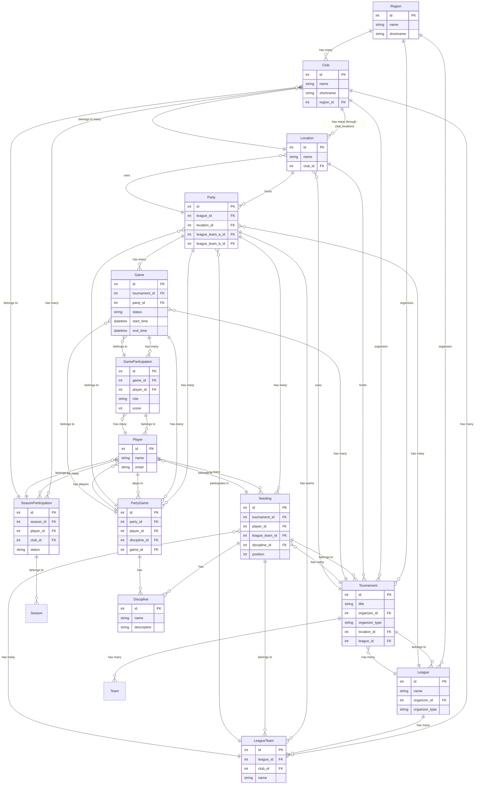

# ER Diagram of the Carambus Database

This document shows the Entity-Relationship diagram of the Carambus database structure.

## Overview

The ER diagram shows the relationships between the main entities in the Carambus system:
- **Regions** organize clubs, tournaments and leagues
- **Clubs** have locations and organize tournaments
- **Tournaments** are held at locations and belong to leagues
- **Leagues** have match days (parties) and teams
- **Match days** consist of games between teams
- **Games** are played by players

## Important Change: Player-Club Relationship

**⚠️ IMPORTANT**: The relationship between players and clubs has changed:
- **Historically**: Players belonged directly to a club (`Player.club_id`)
- **Currently**: Players belong to clubs through `SeasonParticipation`
- **Advantage**: A player can play for different clubs in different seasons

## Complete ER Diagram



## Relationship Types

### 1:1 (One-to-One)
- **One player** has **one email address**
- **One game** has **one status**

### 1:N (One-to-Many)
- **One region** has **many clubs**
- **One club** has **many locations**
- **One tournament** has **many games**

### N:M (Many-to-Many)
- **Clubs** have **many locations** through `club_locations`
- **Players** play in **many games** through `game_participations`
- **Games** belong to **many match days** through `party_games`
- **⚠️ NEW: Players belong to many clubs** through `season_participations`

## Important Changes in the Data Model

### Player.club_id (HISTORICAL)
```ruby
# This relationship is NO LONGER used
class Player < ApplicationRecord
  # belongs_to :club  # DEPRECATED
  has_many :season_participations, dependent: :destroy
  has_many :clubs, through: :season_participations
end
```

### SeasonParticipation (CURRENT)
```ruby
# This relationship is CURRENTLY used
class SeasonParticipation < ApplicationRecord
  belongs_to :season
  belongs_to :player
  belongs_to :club
  
  # Status: "active", "passive", "guest"
  validates :status, presence: true
end
```

### Advantages of the New Structure
1. **Flexibility**: Players can play for different clubs in different seasons
2. **Historical Data**: Complete history of club memberships
3. **Status Management**: Different statuses (active, passive, guest)
4. **Season-based Management**: Clear separation by seasons

## Key Attributes

### Primary Keys (PK)
- `id`: Unique identification of each entity
- Auto-increment integer values

### Foreign Keys (FK)
- `region_id`: Reference to the parent region
- `club_id`: Reference to the associated club (in SeasonParticipation)
- `tournament_id`: Reference to the tournament
- `league_id`: Reference to the league
- `location_id`: Reference to the location
- `player_id`: Reference to the player

## Data Integrity

### Referential Integrity
- All foreign keys reference valid primary keys
- CASCADE deletions for dependent records
- RESTRICT deletions for critical relationships

### Business Rules
- **⚠️ CHANGED**: A player can play for different clubs in different seasons
- A tournament can only take place at one location
- A match day belongs to exactly one league

## Migration from the Old Structure

### Old Structure (DEPRECATED)
```ruby
# This relationship is NO LONGER used
Player.find(1).club  # Direct club membership
```

### New Structure (CURRENT)
```ruby
# This relationship is CURRENTLY used
player = Player.find(1)

# Current club (last active SeasonParticipation)
player.club  # Method in Player model

# All club memberships
player.season_participations.includes(:club, :season)

# Club in specific season
player.season_participations.find_by(season: current_season)&.club
```

## Extended Relationships

### Polymorphic Relationships
```ruby
# Tournament can be organized by Region or Club
belongs_to :organizer, polymorphic: true

# Usage
tournament.organizer_type # "Region" or "Club"
tournament.organizer_id   # ID of the organizing entity
```

### Junction Tables
```ruby
# club_locations connects Clubs and Locations
class ClubLocation < ApplicationRecord
  belongs_to :club
  belongs_to :location
end

# season_participations connects Players, Clubs and Seasons
class SeasonParticipation < ApplicationRecord
  belongs_to :season
  belongs_to :player
  belongs_to :club
end
```

## Performance Optimizations

### Indexes
- All foreign keys are indexed
- Composite indexes for frequent queries
- Unique indexes for business rules
- **⚠️ NEW**: `index_season_participations_on_foreign_keys` for (player_id, club_id, season_id)

### Query Optimization
- Eager Loading to avoid N+1 problem
- Scopes for frequent filters
- Counter Caches for counts
- **⚠️ NEW**: Optimized queries through SeasonParticipation

## Data Model Changes

### Migrations
```bash
# Create new table
rails generate migration CreateNewTable

# Add column
rails generate migration AddColumnToTable

# Run migration
rails db:migrate
```

### Rollback
```bash
# Undo last migration
rails db:rollback

# Go back to specific version
rails db:migrate VERSION=20231201000000
```

## Monitoring and Maintenance

### Database Size
- Regular checking of table sizes
- Archiving old data
- Cleanup of deleted records

### Performance Monitoring
- Identify slow queries
- Optimize indexes
- Analyze query plans
- **⚠️ NEW**: Monitor SeasonParticipation queries

## Best Practices

### Modeling
- **Normalization**: Avoid redundancy
- **Denormalization**: For performance when needed
- **Consistency**: Uniform naming conventions
- **⚠️ NEW**: Use SeasonParticipation for Player-Club relationships

### Development
- **Migrations**: Always make them reversible
- **Validations**: At model and database level
- **Tests**: Test database logic
- **⚠️ NEW**: Test SeasonParticipation logic

### Maintenance
- **Backups**: Regular backups
- **Updates**: Plan database updates
- **Monitoring**: Continuously monitor performance
- **⚠️ NEW**: Monitor SeasonParticipation performance

## Summary of Changes

### What has changed?
1. **Player.club_id**: No longer used (historical)
2. **SeasonParticipation**: New N:M relationship between Player, Club and Season
3. **Flexibility**: Players can play for different clubs in different seasons
4. **Status Management**: Different statuses for club membership

### What remains the same?
1. **Basic Structure**: All other relationships remain unchanged
2. **API**: Existing API endpoints continue to work
3. **Views**: Existing views continue to work

### Recommendations
1. **Use SeasonParticipation** for all Player-Club relationships
2. **Avoid direct access** to Player.club_id
3. **Test all queries** with the new structure
4. **Document the changes** for the team 