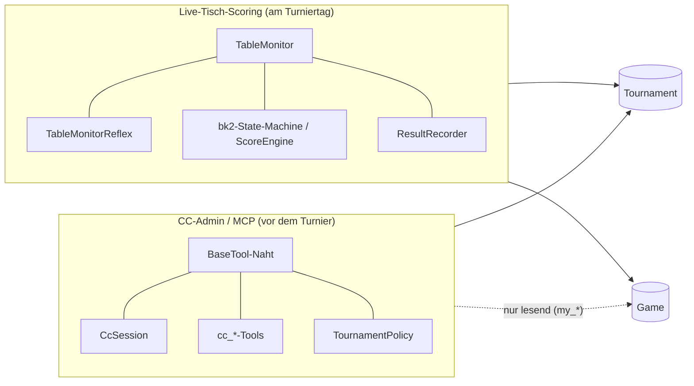
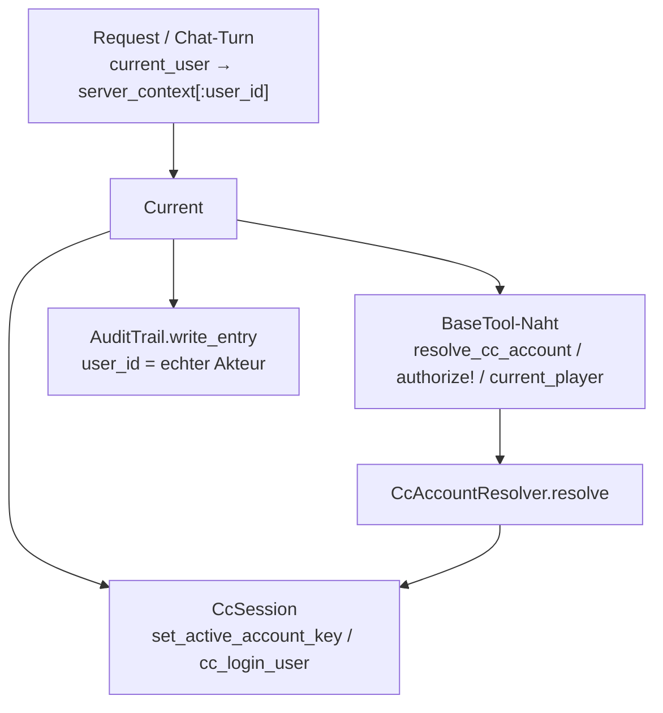
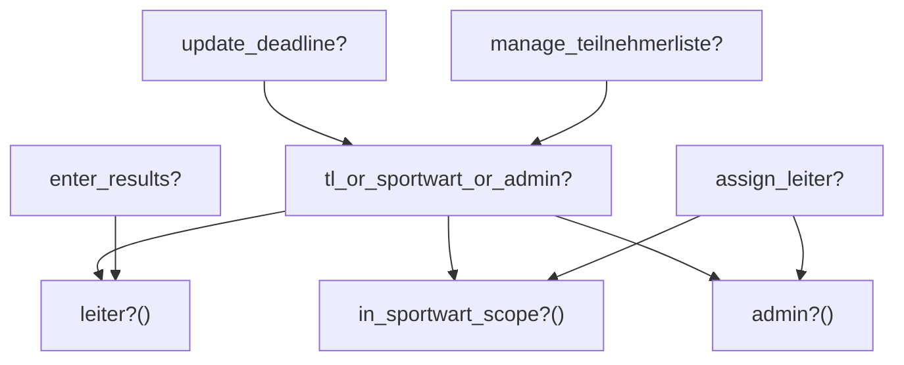
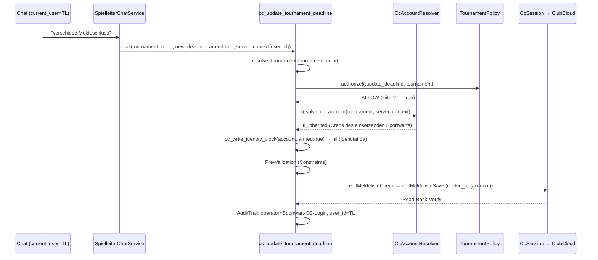

# MCP-Server — Architektur-Naht: Identität, Autorisierung, Domänen-Grenze

> **Zielgruppe:** Entwickler, die den MCP-Server erweitern oder verstehen wollen, *warum* er so aufgebaut ist.
> **Abgrenzung:** Das [ClubCloud-MCP-Handbuch](clubcloud-mcp-server.de.md) beschreibt *was* die Tools tun (Referenz, Datei-Layout, Datenfluss). Die [Per-User-ClubCloud-Identität](per-user-cc-identitaet.de.md) beschreibt den v1.1-Identitäts-Mechanismus im Detail. **Dieses Kapitel** beschreibt die *querschnittlichen Nähte*, die alle Tools teilen — und die im Code zentral, aber bisher kaum dokumentiert sind.
>
> *Entstanden aus einer graphify-Analyse (Code+Doku-Wissensgraph, 2026-06-16): die Naht-Cluster `BaseTool`, `CcSession`-Internals, `CcAccountResolver` und die Autorisierungs-Concerns waren strukturell zentral, aber doku-seitig „pure-code". Dieses Kapitel schließt die Lücke.*

---

## 1. Die zwei Domänen von Carambus

Carambus zerfällt strukturell in **zwei fast disjunkte Hälften**. Das ist keine bewusste Schichtung, sondern ergibt sich aus zwei unterschiedlichen Aufgaben — und es ist hilfreich, das beim Erweitern im Kopf zu haben:



**Konsequenzen für Entwickler:**

- Die beiden Hälften teilen sich **nur die Datenmodelle `Game` und `Tournament`** (die beiden mit Abstand am stärksten vernetzten Knoten im Graph).
- Der **MCP-Server fasst die Live-Scoring-State-Machine NIE an.** Die einzige Berührung ist *lesend*: `cc_my_results` / `cc_my_ranking` lesen `game_participations`. Wer ein MCP-Tool baut, das in `TableMonitor`/`bk2` schreibt, hat mit hoher Wahrscheinlichkeit die Domänen-Grenze verletzt — kurz innehalten.
- Umgekehrt: Live-Scoring-Code (Reflexes, ScoreEngine) braucht **keine** CC-Session und **keine** Per-User-Identität — diese ganze Naht ist für ihn irrelevant.

---

## 2. Die Identitäts-Achse: `Current` als Rückgrat

Die zentrale Designentscheidung des MCP-Servers (verschärft in v1.1): **Identität wird nicht als Parameter durch jeden Aufruf gefädelt, sondern an jeder Schicht aus dem request-scoped Kontext gezogen.**

Träger ist `Current` (`app/models/current.rb`, ein `ActiveSupport::CurrentAttributes`). Der MCP-Pfad reicht den handelnden User über `server_context[:user_id]` durch — gesetzt im `McpController` bzw. `SpielleiterChatService` aus `current_user` (inkl. pretender-Impersonation).



**Warum das wichtig ist:** `Current` ist der Knoten mit der höchsten Betweenness-Zentralität im ganzen Graphen — **drei** unabhängige Naht-Komponenten greifen darauf zu. Wer die Semantik von `Current`/`server_context[:user_id]` ändert, berührt damit gleichzeitig die Session-Wahl, die Berechtigungsprüfung **und** die Audit-Attribution. Das ist die strukturelle Achillessehne des MCP-Servers — Änderungen hier mit besonderer Sorgfalt.

---

## 3. Die BaseTool-Schreib-Naht (der Engpass)

Jedes der 7 CC-Write-Tools (`cc_register_for_tournament`, `cc_assign_player_to_teilnehmerliste`, `cc_fast_assign_to_teilnehmerliste`, `cc_remove_from_teilnehmerliste`, `cc_unregister_for_tournament`, `cc_finalize_teilnehmerliste`, `cc_update_tournament_deadline`) läuft durch **dieselbe Naht** in `lib/mcp_server/tools/base_tool.rb`. Diese Helfer halten den Per-Tool-Diff einzeilig (analog zu `authorize!`):

| Helfer | Aufgabe | Rückgabe |
|---|---|---|
| `resolve_cc_account(tournament:, server_context:)` | Effektive CC-Identität bestimmen (delegiert an `CcAccountResolver`) | `CcAccount` (kann `:none` sein) |
| `cc_write_identity_block(account, armed:)` | Hard-Block-Gate: `armed:true` **ohne** auflösbare Identität → jargonfreie Absage | `error(...)` oder `nil` |
| `cc_identity_hint(account)` | Nicht-blockierender Dry-Run-Hinweis für authentifizierte User ohne Creds | String oder `nil` |
| `cc_audit_operator` | CC-Login-Account des aktiven Accounts (für AuditTrail-`operator`) | String |
| `authorize!(action:, tournament:, server_context:)` | Per-Record-Autorisierung über `TournamentPolicy` (s. §4) | `error(...)` oder `nil` |
| `resolve_tournament(meldeliste_cc_id:, tournament_cc_id:, server_context:)` | Context-scoped Tournament-Auflösung (cc_id ist **nicht** global eindeutig!) | `Tournament` oder `nil` |

**Reihenfolge in einem typischen Write-Tool `call`:**

```ruby
# 1. Turnier identifizieren (context-scoped — sonst falscher Verbands-Datensatz)
resolved_tournament = resolve_tournament(meldeliste_cc_id:, tournament_cc_id:, server_context:)

# 2. Per-Record-Autorisierung (nur wenn Turnier auflösbar)
if resolved_tournament
  err = authorize!(action: :update_deadline, tournament: resolved_tournament, server_context:)
  return err if err
end

# 3. Effektive CC-Identität auflösen
account = resolve_cc_account(tournament: resolved_tournament, server_context:)

# 4. Hard-Block am armed-Gate (Dry-Run bleibt erlaubt)
identity_block = cc_write_identity_block(account, armed:)
return identity_block if identity_block

# 5. Pre-Validation (Tool-eigene Constraints) → 6. armed-POST unter cookie_for(account)
```

> ⚠️ **Lehre (v1.1 Live-Test, Commits `2a65c17c`/`70ddbd2d`):** Die Identitäts-Naht ist nur so robust wie die **Vorstufen**. Wenn `resolve_tournament` das Turnier nicht identifiziert (z.B. weil nur eine nicht-rückmappbare `meldeliste_cc_id` übergeben wurde und der DB-Spiegel sie nicht kennt), kann die turnier-scoped TL-Vererbung gar nicht greifen → `account = :none` → irreführender „hinterlege deine Zugangsdaten"-Block. Beim Bauen/Ändern eines Write-Tools also IMMER prüfen: kommt ein robust auflösbares Turnier in die Naht? Scope (`branch_cc_id`/`season`/`fed_cc_id`) bei Bedarf aus dem Turnier ableiten, nicht vom (kleinen) LLM erwarten.

---

## 4. Zwei-Schichten-Autorisierung

CC-Schreibrecht wird an **zwei orthogonalen Schichten** geprüft. Beide müssen passen.

### Schicht 1 — grobes Tier-Gating (welche Persona darf überhaupt schreiben?)

`UserPersonas#cc_write_access?` (`app/models/concerns/user_personas.rb`):

```ruby
cc_write_access? == system_admin? || sportwart? || turnierleiter?
```

`ToolRegistry.tools_for(user)` filtert darauf: ein read-only User (player/club_admin ohne Persona/TL) bekommt die Write-Tools **gar nicht erst** in die Tool-Liste. Es gibt ein zweites, orthogonales Gate: Write-Tools werden **nur bei `cc_write_access? && local_server?`** angehängt — auf der Authority (`carambus_api_url` blank) bekommt also selbst ein `system_admin` ein read-only Tool-Set (Phase 39). `sportwart?` leitet sich aus der expliziten `users.persona_grants`-Spalte ab (`sportwart` location-scoped, `landessportwart` region-weit — Phase 38).

### Schicht 2 — feine Per-Record-Authority (darf dieser User DIESE Aktion an DIESEM Turnier?)

`authorize!` → `TournamentPolicy` (`app/policies/tournament_policy.rb`):



- `update_deadline?` / `manage_teilnehmerliste?` → `leiter? OR in_sportwart_scope? OR admin?`
- `enter_results?` → nur `leiter?` (nur der Turnierleiter trägt Ergebnisse ein)
- `assign_leiter?` → nur `in_sportwart_scope? OR admin?` (ein TL kann **keinen** weiteren TL ernennen)

`leiter?` (`app/models/concerns/tournament_leiter.rb`) ist eine **Union**: globales `Tournament.turnier_leiter_user_id` **ODER** lokale `UserTournament(role: "turnier_leiter")`-Relation.

**Wie die Schichten zusammenspielen** (live verifiziert): Ein Turnierleiter *sieht* die Write-Tools (Schicht 1: `turnierleiter?` zählt), darf via `leiter?` aber nur sein eigenes Turnier beschreiben — auch wenn das Turnier *außerhalb* seines Disziplin-/Location-Scopes liegt (`in_sportwart_scope? == false`). Beispiel aus dem Live-Test: joerg.unger (Kegel-TL) auf einem Karambol-Turnier → `update_deadline? == true` via `leiter?`, obwohl Scope `false`.

---

## 5. CC-Identität: die drei Quellen (`CcAccountResolver`)

`McpServer::CcAccountResolver.resolve(user:, tournament:)` ist **reine DB-/Modell-Logik** (keine HTTP-Calls, unit-testbar). Auflösungskette:

| Quelle | Bedingung | `CcAccount.source` |
|---|---|---|
| **eigene Creds** | `user.cc_credentials_present?` | `:own` |
| **TL-Vererbung** | User ist TL via `UserTournament` für *dieses* Turnier UND `granted_by` hat eigene Creds | `:tl_inherited` |
| **keine** | sonst (kein shared_fallback!) | `:none` |

Der `CcSession`-Cache wird per **Login-Username** gekeyt (der CC-Account, dem die PHPSESSID gehört) — zwei TL desselben Granters teilen damit eine Session. Die **zweischichtige Audit-Attribution** trennt:

- `operator` = `cc_audit_operator` (CC-Login-Account — was die ClubCloud sieht)
- `user_id` = `account.acting_user_id` (der echte Carambus-Akteur)

> **D-39-9 / D-39-10:** Nur die 7 CC-Write-Tools sind verdrahtet. Read-Tools + DB-Write-Tools (`assign_tournament_leiter`, `link_my_player`) bleiben auf der geteilten Default-Session. Der `:none`-Block greift NUR im authentifizierten Kontext (`acting_user_id` gesetzt) — der User-lose Stdio-Pfad (`bin/mcp-server`) behält die geteilte Admin-Session (Backwards-Compat).

Details: [Per-User-ClubCloud-Identität](per-user-cc-identitaet.de.md).

---

## 6. End-to-End: Lebenszyklus eines armed-Write-Calls

Am Beispiel „Turnierleiter verschiebt den Meldeschluss":



Read-Tools überspringen Schritt `authorize!`/`resolve_cc_account`/Block und laufen direkt über die geteilte Lese-Session.

---

## 7. Datei-Landkarte (wo liegt die Naht?)

| Naht-Aspekt | Datei |
|---|---|
| Schreib-Gate-Helfer, `authorize!`, `resolve_tournament` | `lib/mcp_server/tools/base_tool.rb` |
| Identitäts-Resolver | `lib/mcp_server/cc_account_resolver.rb` |
| Per-Account-Session, `cookie_for`, `cc_login_user`, `with_session_recovery` | `lib/mcp_server/cc_session.rb` |
| Tier-Gating | `app/models/concerns/user_personas.rb` |
| Per-Record-Policy | `app/policies/tournament_policy.rb` |
| TL-Union | `app/models/concerns/tournament_leiter.rb` · `app/models/user_tournament.rb` |
| Identitäts-Träger | `app/models/current.rb` |
| Persona-Gefiltertes Tool-Set | `lib/mcp_server/tool_registry.rb` · `lib/mcp_server/role_tool_map.rb` |

---

## 8. Erweitern: Checkliste für ein neues CC-Write-Tool

1. Von `BaseTool` ableiten, `armed: false`-Default + `destructive_hint: true`.
2. **Turnier robust auflösen** (`resolve_tournament`), Scope bei Bedarf aus dem Turnier ableiten — nicht vom LLM erwarten.
3. `authorize!(action:, tournament:, server_context:)` aufrufen, Fehler durchreichen. Ggf. neue Action in `TournamentPolicy` + `ALLOWED_AUTHORITY_ACTIONS` ergänzen.
4. `resolve_cc_account` + `cc_write_identity_block(account, armed:)` vor dem POST.
5. POST unter `cc_session.cookie_for(account)` (NICHT `cookie`).
6. AuditTrail mit `operator: cc_audit_operator`, `user_id: account.acting_user_id`.
7. Tool in `role_tool_map.rb` (`WRITE_TOOLS`) eintragen — das ist die **einzige** Quelle für den HTTP-Pfad. `ToolRegistry.tool_classes_for(user)` und `SpielleiterChatService` konsumieren sie beide; es gibt **keine** zweite `TOOL_CLASSES`-Liste (D-34-3 hat die alte Zwei-Listen-Drift-Falle aufgelöst). Write-Tools erreichen einen User nur, wenn `cc_write_access? && local_server?`.
8. Pre-Validation-First: alle Constraints VOR `armed:true` prüfen.

---

*Verwandt: [ClubCloud-MCP-Handbuch](clubcloud-mcp-server.de.md) · [Per-User-ClubCloud-Identität](per-user-cc-identitaet.de.md) · [Workflow-Scenarios](clubcloud-mcp-workflow-scenarios.de.md)*
