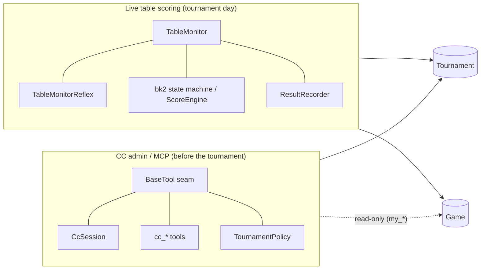
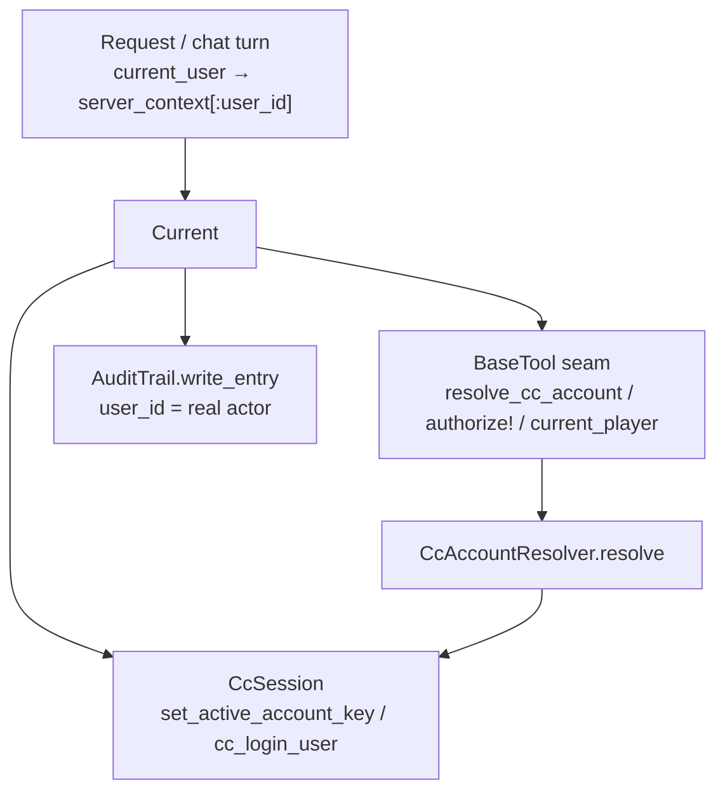
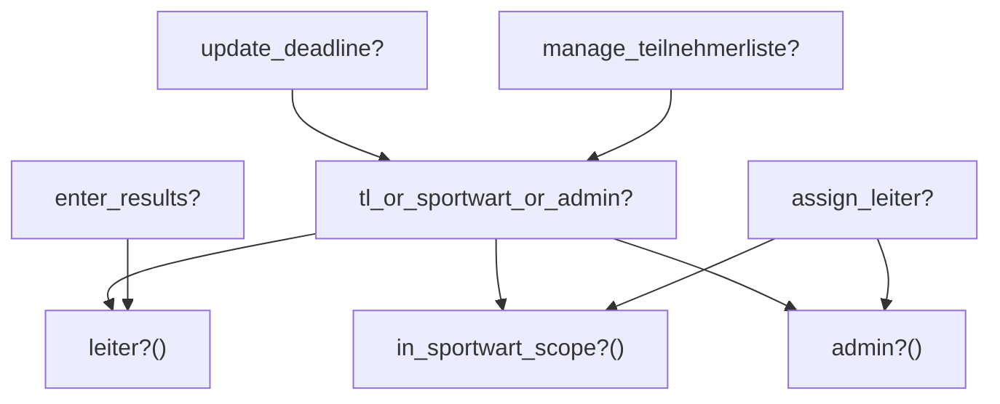
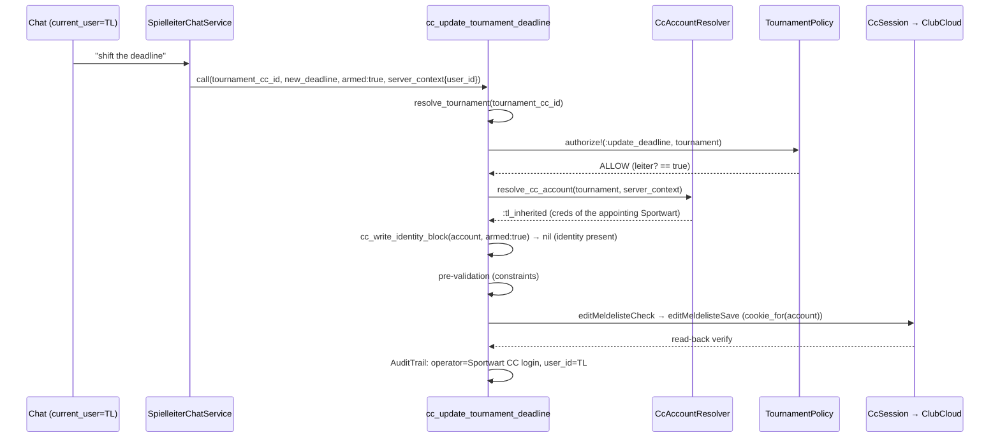

# MCP Server — Architectural Seam: Identity, Authorization, Domain Boundary

> **Audience:** Developers who extend the MCP server or want to understand *why* it is built the way it is.
> **Scope:** The [ClubCloud MCP handbook](clubcloud-mcp-server.de.md) describes *what* the tools do (reference, file layout, data flow). [Per-User ClubCloud Identity](per-user-cc-identitaet.de.md) covers the v1.1 identity mechanism in detail. **This chapter** describes the *cross-cutting seams* that all tools share — central in the code, but barely documented until now. (Related docs are currently German-only.)
>
> *Produced from a graphify analysis (combined code+docs knowledge graph, 2026-06-16): the seam clusters `BaseTool`, `CcSession` internals, `CcAccountResolver` and the authorization concerns were structurally central yet "pure-code" on the documentation side. This chapter closes that gap.*

---

## 1. The two domains of Carambus

Structurally, Carambus splits into **two almost disjoint halves**. This is not a deliberate layering — it emerges from two different jobs — and it helps to keep it in mind when extending the system:



**Consequences for developers:**

- The two halves share **only the data models `Game` and `Tournament`** (the two most heavily connected nodes in the graph).
- The **MCP server NEVER touches the live-scoring state machine.** The only contact is *read-only*: `cc_my_results` / `cc_my_ranking` read `game_participations`. If you build an MCP tool that writes into `TableMonitor`/`bk2`, you have most likely crossed the domain boundary — pause and reconsider.
- Conversely, live-scoring code (reflexes, ScoreEngine) needs **no** CC session and **no** per-user identity — this entire seam is irrelevant to it.

---

## 2. The identity axis: `Current` as the backbone

The MCP server's central design decision (tightened in v1.1): **identity is not threaded as a parameter through every call, but pulled from the request-scoped context at each layer.**

The carrier is `Current` (`app/models/current.rb`, an `ActiveSupport::CurrentAttributes`). The MCP path passes the acting user via `server_context[:user_id]` — set in `McpController` / `SpielleiterChatService` from `current_user` (including pretender impersonation).



**Why this matters:** `Current` is the node with the highest betweenness centrality in the whole graph — **three** independent seam components read from it. Changing the semantics of `Current` / `server_context[:user_id]` therefore simultaneously affects session selection, the permission check **and** audit attribution. It is the structural Achilles' heel of the MCP server — change it with extra care.

---

## 3. The BaseTool write seam (the chokepoint)

Each of the 7 CC write tools (`cc_register_for_tournament`, `cc_assign_player_to_teilnehmerliste`, `cc_fast_assign_to_teilnehmerliste`, `cc_remove_from_teilnehmerliste`, `cc_unregister_for_tournament`, `cc_finalize_teilnehmerliste`, `cc_update_tournament_deadline`) flows through the **same seam** in `lib/mcp_server/tools/base_tool.rb`. These helpers keep the per-tool diff one line (analogous to `authorize!`):

| Helper | Purpose | Returns |
|---|---|---|
| `resolve_cc_account(tournament:, server_context:)` | Determine effective CC identity (delegates to `CcAccountResolver`) | `CcAccount` (may be `:none`) |
| `cc_write_identity_block(account, armed:)` | Hard-block gate: `armed:true` **without** a resolvable identity → jargon-free refusal | `error(...)` or `nil` |
| `cc_identity_hint(account)` | Non-blocking dry-run hint for authenticated users without creds | String or `nil` |
| `cc_audit_operator` | CC login account of the active account (for AuditTrail `operator`) | String |
| `authorize!(action:, tournament:, server_context:)` | Per-record authorization via `TournamentPolicy` (see §4) | `error(...)` or `nil` |
| `resolve_tournament(meldeliste_cc_id:, tournament_cc_id:, server_context:)` | Context-scoped tournament resolution (cc_id is **not** globally unique!) | `Tournament` or `nil` |

**Order in a typical write tool `call`:**

```ruby
# 1. Identify the tournament (context-scoped — otherwise wrong federation record)
resolved_tournament = resolve_tournament(meldeliste_cc_id:, tournament_cc_id:, server_context:)

# 2. Per-record authorization (only if the tournament resolved)
if resolved_tournament
  err = authorize!(action: :update_deadline, tournament: resolved_tournament, server_context:)
  return err if err
end

# 3. Resolve the effective CC identity
account = resolve_cc_account(tournament: resolved_tournament, server_context:)

# 4. Hard-block at the armed gate (dry-run stays allowed)
identity_block = cc_write_identity_block(account, armed:)
return identity_block if identity_block

# 5. Pre-validation (tool-specific constraints) → 6. armed POST under cookie_for(account)
```

> ⚠️ **Lesson (v1.1 live test, commits `2a65c17c`/`70ddbd2d`):** The identity seam is only as robust as its **upstream steps**. If `resolve_tournament` fails to identify the tournament (e.g. because only a non-reverse-mappable `meldeliste_cc_id` was passed and the DB mirror does not know it), the tournament-scoped TL inheritance cannot kick in → `account = :none` → a misleading "deposit your credentials" block. So when building/changing a write tool, ALWAYS verify: does a robustly resolvable tournament enter the seam? Derive scope (`branch_cc_id`/`season`/`fed_cc_id`) from the tournament when needed — do not expect it from the (small) LLM.

---

## 4. Two-layer authorization

CC write permission is checked at **two orthogonal layers**. Both must pass.

### Layer 1 — coarse tier gating (which persona may write at all?)

`UserPersonas#cc_write_access?` (`app/models/concerns/user_personas.rb`):

```ruby
cc_write_access? == system_admin? || sportwart? || turnierleiter?
```

`ToolRegistry.tools_for(user)` filters on this: a read-only user (player/club_admin without persona/TL) does **not even receive** the write tools in the tool list. There is a second, orthogonal gate: write tools are appended **only if `cc_write_access? && local_server?`** — so on the Authority (`carambus_api_url` blank) even a `system_admin` gets a read-only tool set (Phase 39). `sportwart?` derives from the explicit `users.persona_grants` column (`sportwart` location-scoped, `landessportwart` region-wide — Phase 38).

### Layer 2 — fine per-record authority (may this user do THIS action on THIS tournament?)

`authorize!` → `TournamentPolicy` (`app/policies/tournament_policy.rb`):



- `update_deadline?` / `manage_teilnehmerliste?` → `leiter? OR in_sportwart_scope? OR admin?`
- `enter_results?` → `leiter?` only (only the tournament leader enters results)
- `assign_leiter?` → `in_sportwart_scope? OR admin?` only (a TL **cannot** appoint another TL)

`leiter?` (`app/models/concerns/tournament_leiter.rb`) is a **union**: global `Tournament.turnier_leiter_user_id` **OR** the local `UserTournament(role: "turnier_leiter")` relation.

**How the layers interact** (verified live): a tournament leader *sees* the write tools (layer 1: `turnierleiter?` counts), but via `leiter?` may write only to their own tournament — even if the tournament lies *outside* their discipline/location scope (`in_sportwart_scope? == false`). Example from the live test: joerg.unger (a snooker/Kegel TL) on a Carom tournament → `update_deadline? == true` via `leiter?`, although scope is `false`.

---

## 5. CC identity: the three sources (`CcAccountResolver`)

`McpServer::CcAccountResolver.resolve(user:, tournament:)` is **pure DB/model logic** (no HTTP calls, unit-testable). Resolution chain:

| Source | Condition | `CcAccount.source` |
|---|---|---|
| **own creds** | `user.cc_credentials_present?` | `:own` |
| **TL inheritance** | user is TL via `UserTournament` for *this* tournament AND `granted_by` has own creds | `:tl_inherited` |
| **none** | otherwise (no shared_fallback!) | `:none` |

The `CcSession` cache is keyed by **login username** (the CC account that owns the PHPSESSID) — two TLs of the same granter therefore share one session. The **two-layer audit attribution** separates:

- `operator` = `cc_audit_operator` (CC login account — what ClubCloud sees)
- `user_id` = `account.acting_user_id` (the real Carambus actor)

> **D-39-9 / D-39-10:** Only the 7 CC write tools are wired. Read tools + DB write tools (`assign_tournament_leiter`, `link_my_player`) stay on the shared default session. The `:none` block applies ONLY in the authenticated context (`acting_user_id` set) — the user-less stdio path (`bin/mcp-server`) keeps the shared admin session (backwards compatibility).

Details: [Per-User ClubCloud Identity](per-user-cc-identitaet.de.md).

---

## 6. End-to-end: lifecycle of an armed write call

Using "a tournament leader shifts the registration deadline" as the example:



Read tools skip the `authorize!`/`resolve_cc_account`/block steps and run directly over the shared read session.

---

## 7. File map (where is the seam?)

| Seam aspect | File |
|---|---|
| Write-gate helpers, `authorize!`, `resolve_tournament` | `lib/mcp_server/tools/base_tool.rb` |
| Identity resolver | `lib/mcp_server/cc_account_resolver.rb` |
| Per-account session, `cookie_for`, `cc_login_user`, `with_session_recovery` | `lib/mcp_server/cc_session.rb` |
| Tier gating | `app/models/concerns/user_personas.rb` |
| Per-record policy | `app/policies/tournament_policy.rb` |
| TL union | `app/models/concerns/tournament_leiter.rb` · `app/models/user_tournament.rb` |
| Identity carrier | `app/models/current.rb` |
| Persona-filtered tool set | `lib/mcp_server/tool_registry.rb` · `lib/mcp_server/role_tool_map.rb` |

---

## 8. Extending: checklist for a new CC write tool

1. Subclass `BaseTool`, default `armed: false` + `destructive_hint: true`.
2. **Resolve the tournament robustly** (`resolve_tournament`), derive scope from the tournament when needed — do not expect it from the LLM.
3. Call `authorize!(action:, tournament:, server_context:)`, propagate the error. Add a new action to `TournamentPolicy` + `ALLOWED_AUTHORITY_ACTIONS` if needed.
4. `resolve_cc_account` + `cc_write_identity_block(account, armed:)` before the POST.
5. POST under `cc_session.cookie_for(account)` (NOT `cookie`).
6. AuditTrail with `operator: cc_audit_operator`, `user_id: account.acting_user_id`.
7. Register the tool in `role_tool_map.rb` (`WRITE_TOOLS`) — that is the **single** source for the HTTP path. `ToolRegistry.tool_classes_for(user)` and `SpielleiterChatService` both consume it; there is **no** second `TOOL_CLASSES` list (D-34-3 collapsed the old two-list drift trap). Write tools reach a user only if `cc_write_access? && local_server?`.
8. Pre-validation-first: check all constraints BEFORE `armed:true`.

---

*Related: [ClubCloud MCP handbook](clubcloud-mcp-server.de.md) · [Per-User ClubCloud Identity](per-user-cc-identitaet.de.md) · [Workflow Scenarios](clubcloud-mcp-workflow-scenarios.de.md) (German-only)*
