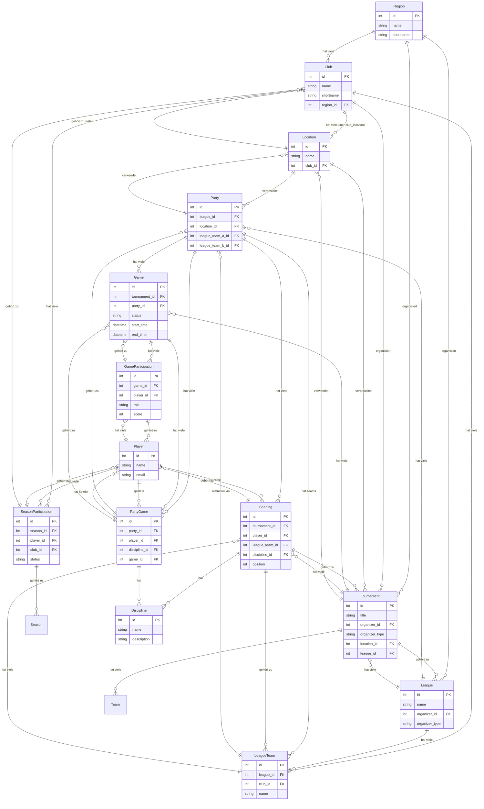

# ER-Diagramm der Carambus-Datenbank

Dieses Dokument zeigt das Entity-Relationship-Diagramm der Carambus-Datenbankstruktur.

## Übersicht

Das ER-Diagramm zeigt die Beziehungen zwischen den wichtigsten Entitäten im Carambus-System:
- **Regionen** organisieren Vereine, Turniere und Ligen
- **Vereine** haben Standorte und organisieren Turniere
- **Turniere** werden an Standorten ausgetragen und gehören zu Ligen
- **Ligen** haben Spieltage (Parties) und Teams
- **Spieltage** bestehen aus Spielen zwischen Teams
- **Spiele** werden von Spielern bestritten

## Wichtige Änderung: Player-Club-Beziehung

**⚠️ WICHTIG**: Die Beziehung zwischen Spielern und Vereinen hat sich geändert:
- **Historisch**: Spieler gehörten direkt zu einem Verein (`Player.club_id`)
- **Aktuell**: Spieler gehören über `SeasonParticipation` zu Vereinen
- **Vorteil**: Ein Spieler kann in verschiedenen Saisons für verschiedene Vereine spielen

## Vollständiges ER-Diagramm



## Beziehungsarten

### 1:1 (Eins-zu-Eins)
- **Ein Spieler** hat **eine E-Mail-Adresse**
- **Ein Spiel** hat **einen Status**

### 1:N (Eins-zu-Viele)
- **Eine Region** hat **viele Vereine**
- **Ein Verein** hat **viele Standorte**
- **Ein Turnier** hat **viele Spiele**

### N:M (Viele-zu-Viele)
- **Vereine** haben **viele Standorte** über `club_locations`
- **Spieler** spielen in **vielen Spielen** über `game_participations`
- **Spiele** gehören zu **vielen Spieltagen** über `party_games`
- **⚠️ NEU: Spieler gehören zu vielen Vereinen** über `season_participations`

## Wichtige Änderungen im Datenmodell

### Player.club_id (HISTORISCH)
```ruby
# Diese Beziehung wird NICHT mehr verwendet
class Player < ApplicationRecord
  # belongs_to :club  # DEPRECATED
  has_many :season_participations, dependent: :destroy
  has_many :clubs, through: :season_participations
end
```

### SeasonParticipation (AKTUELL)
```ruby
# Diese Beziehung wird AKTUELL verwendet
class SeasonParticipation < ApplicationRecord
  belongs_to :season
  belongs_to :player
  belongs_to :club
  
  # Status: "active", "passive", "guest"
  validates :status, presence: true
end
```

### Vorteile der neuen Struktur
1. **Flexibilität**: Spieler können in verschiedenen Saisons für verschiedene Vereine spielen
2. **Historische Daten**: Vollständige Historie der Vereinszugehörigkeit
3. **Status-Management**: Verschiedene Status (aktiv, passiv, Gast)
4. **Saison-basierte Verwaltung**: Klare Trennung nach Spielzeiten

## Schlüsselattribute

### Primärschlüssel (PK)
- `id`: Eindeutige Identifikation jeder Entität
- Auto-increment Integer-Werte

### Fremdschlüssel (FK)
- `region_id`: Verweis auf die übergeordnete Region
- `club_id`: Verweis auf den zugehörigen Verein (in SeasonParticipation)
- `tournament_id`: Verweis auf das Turnier
- `league_id`: Verweis auf die Liga
- `location_id`: Verweis auf den Standort
- `player_id`: Verweis auf den Spieler

## Datenintegrität

### Referentielle Integrität
- Alle Fremdschlüssel verweisen auf gültige Primärschlüssel
- CASCADE-Löschungen für abhängige Datensätze
- RESTRICT-Löschungen für kritische Beziehungen

### Geschäftsregeln
- **⚠️ GEÄNDERT**: Ein Spieler kann in verschiedenen Saisons für verschiedene Vereine spielen
- Ein Turnier kann nur an einem Standort stattfinden
- Ein Spieltag gehört zu genau einer Liga

## Migration von der alten Struktur

### Alte Struktur (DEPRECATED)
```ruby
# Diese Beziehung wird NICHT mehr verwendet
Player.find(1).club  # Direkte Vereinszugehörigkeit
```

### Neue Struktur (AKTUELL)
```ruby
# Diese Beziehung wird AKTUELL verwendet
player = Player.find(1)

# Aktueller Verein (letzte aktive SeasonParticipation)
player.club  # Methode im Player-Modell

# Alle Vereinszugehörigkeiten
player.season_participations.includes(:club, :season)

# Verein in bestimmter Saison
player.season_participations.find_by(season: current_season)&.club
```

## Erweiterte Beziehungen

### Polymorphe Beziehungen
```ruby
# Tournament kann von Region oder Club organisiert werden
belongs_to :organizer, polymorphic: true

# Verwendung
tournament.organizer_type # "Region" oder "Club"
tournament.organizer_id   # ID der organiserenden Entität
```

### Durchgangstabellen
```ruby
# club_locations verbindet Clubs und Locations
class ClubLocation < ApplicationRecord
  belongs_to :club
  belongs_to :location
end

# season_participations verbindet Players, Clubs und Seasons
class SeasonParticipation < ApplicationRecord
  belongs_to :season
  belongs_to :player
  belongs_to :club
end
```

## Performance-Optimierungen

### Indizes
- Alle Fremdschlüssel sind indiziert
- Zusammengesetzte Indizes für häufige Abfragen
- Unique-Indizes für Geschäftsregeln
- **⚠️ NEU**: `index_season_participations_on_foreign_keys` für (player_id, club_id, season_id)

### Abfrageoptimierung
- Eager Loading für N+1-Problem vermeiden
- Scopes für häufige Filter
- Counter Caches für Zählungen
- **⚠️ NEU**: Optimierte Abfragen über SeasonParticipation

## Datenmodell-Änderungen

### Migrationen
```bash
# Neue Tabelle erstellen
rails generate migration CreateNewTable

# Spalte hinzufügen
rails generate migration AddColumnToTable

# Migration ausführen
rails db:migrate
```

### Rollback
```bash
# Letzte Migration rückgängig machen
rails db:rollback

# Zu bestimmter Version zurückkehren
rails db:migrate VERSION=20231201000000
```

## Monitoring und Wartung

### Datenbankgröße
- Regelmäßige Überprüfung der Tabellengrößen
- Archivierung alter Daten
- Cleanup von gelöschten Datensätzen

### Performance-Überwachung
- Langsame Abfragen identifizieren
- Indizes optimieren
- Query-Pläne analysieren
- **⚠️ NEU**: SeasonParticipation-Abfragen überwachen

## Best Practices

### Modellierung
- **Normalisierung**: Vermeiden Sie Redundanz
- **Denormalisierung**: Für Performance bei Bedarf
- **Konsistenz**: Einheitliche Namenskonventionen
- **⚠️ NEU**: Verwenden Sie SeasonParticipation für Player-Club-Beziehungen

### Entwicklung
- **Migrationen**: Immer reversibel gestalten
- **Validierungen**: Auf Modell- und Datenbankebene
- **Tests**: Datenbanklogik testen
- **⚠️ NEU**: Testen Sie SeasonParticipation-Logik

### Wartung
- **Backups**: Regelmäßige Sicherungen
- **Updates**: Datenbank-Updates planen
- **Monitoring**: Performance kontinuierlich überwachen
- **⚠️ NEU**: Überwachen Sie SeasonParticipation-Performance

## Zusammenfassung der Änderungen

### Was hat sich geändert?
1. **Player.club_id**: Wird nicht mehr verwendet (historisch)
2. **SeasonParticipation**: Neue N:M-Beziehung zwischen Player, Club und Season
3. **Flexibilität**: Spieler können in verschiedenen Saisons für verschiedene Vereine spielen
4. **Status-Management**: Verschiedene Status für Vereinszugehörigkeit

### Was bleibt gleich?
1. **Grundstruktur**: Alle anderen Beziehungen bleiben unverändert
2. **API**: Bestehende API-Endpunkte funktionieren weiterhin
3. **Views**: Bestehende Views funktionieren weiterhin

### Empfehlungen
1. **Verwenden Sie SeasonParticipation** für alle Player-Club-Beziehungen
2. **Vermeiden Sie direkte Zugriffe** auf Player.club_id
3. **Testen Sie alle Abfragen** mit der neuen Struktur
4. **Dokumentieren Sie die Änderungen** für das Team 