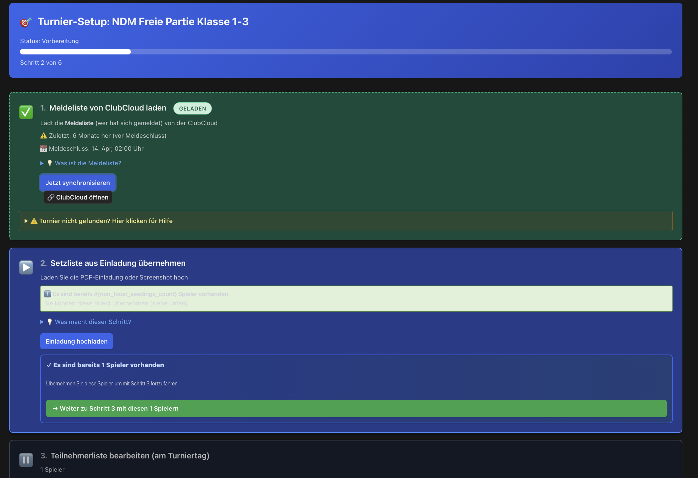
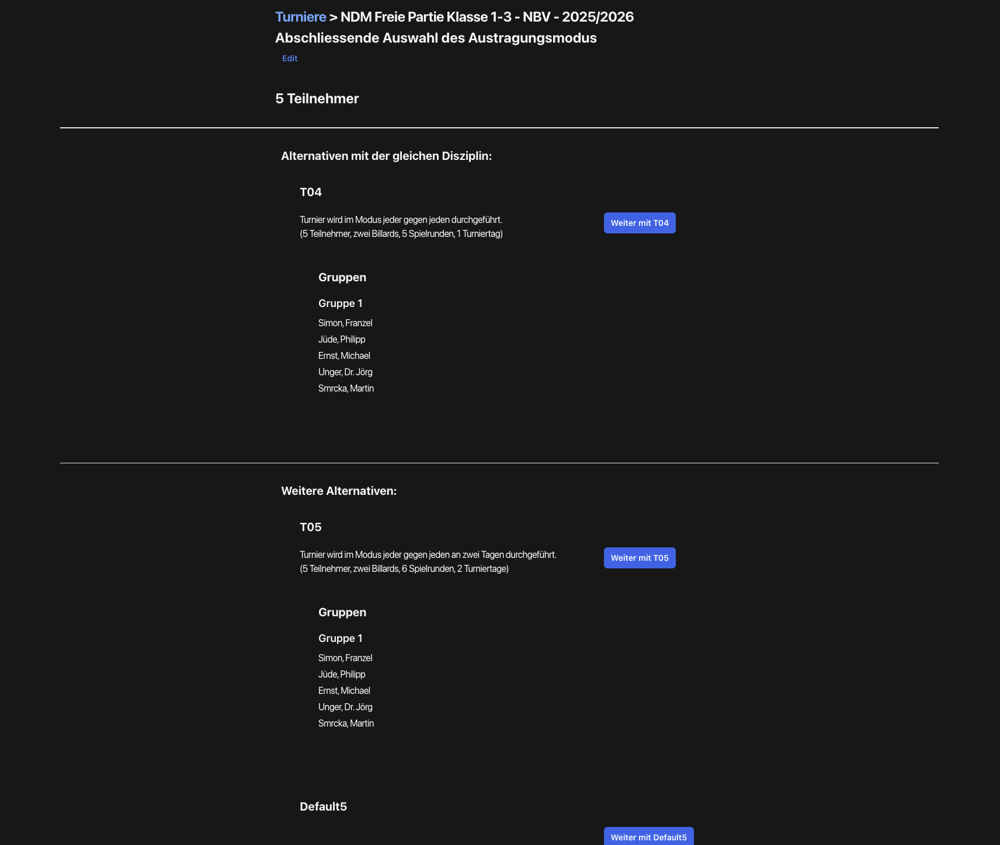
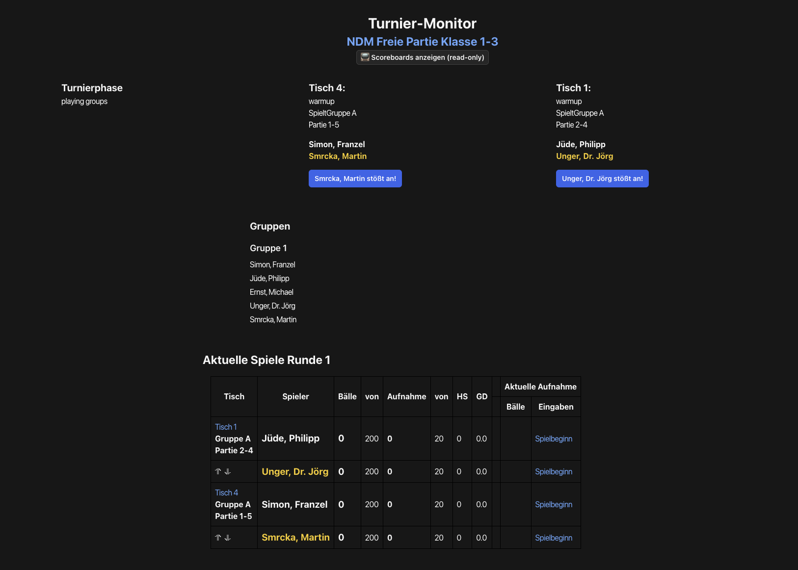

# Tournament Management

This page walks you through running a carom tournament synced from ClubCloud, step by step, from the moment you receive the invitation to the final upload of results.

## Scenario

As the tournament director for your club you have received an NBV invitation for the **NDM Freie Partie Class 1–3** by email as a PDF — a regional carom tournament running one Saturday in your club's playing location with 5 registered players across two tables. The PDF normally serves as your starting reference for managing the tournament. This page walks you through the run from the moment the invitation arrives to the moment the results reach ClubCloud.

For deviating special cases, dedicated flows live in the appendix:

- **[Invitation missing](#appendix-no-invitation)** — flow without a PDF invitation
- **[Player missing](#appendix-missing-player)** — handling registered players who do not show up
- **[Late registration on tournament day](#appendix-nachmeldung)** — on-site player registration

## Walkthrough

The following guide follows the actual flow of the Carambus wizard — as it works in practice. Where the interface uses unfamiliar labels or shows unexpected behaviour, you will find a coloured callout box explaining what to expect.

!!! info "Step numbering is logical, not one-to-one with the UI"
    The steps numbered 1–14 below are a **logical-chronological** breakdown.
    The corresponding UI screens have grown historically and do not always
    map one-to-one: Steps 2–5 all live on the wizard page, Step 6 has its
    own mode-selection screen, Steps 7–8 are the same parametrisation page,
    and from Step 9 onwards the action moves into the Tournament Monitor
    and the table scoreboards. During match play (Steps 10–12) the
    tournament director normally has **no active role** — all actions
    happen at the scoreboards.

### Step 1: Receive the NBV invitation

You receive a PDF invitation from the regional sports officer by email for the NDM. The invitation contains the official tournament plan, the **registration list (Meldeliste)** — the seeding-list snapshot at the close of registration — and the start times. The invitation also lists the **playing targets** for the discipline: the **target balls** (a single value for normal tournaments, or an individual handicap value per player for handicap tournaments) and the **inning limit**. You enter these values into the start form in [Step 7](#step-7-start-form).

Three terms describe the same players at different points in time — keep them straight:

- **Seeding list (Setzliste)** — the seeded/ordered list of registrants, maintained throughout the registration period
- **Registration list (Meldeliste)** — snapshot of the seeding list at the close of registration (this is what the invitation contains)
- **Participant list (Teilnehmerliste)** — the players who **actually** show up on tournament day (finalised shortly before the tournament starts)

The [glossary](#glossary-wizard) covers all three terms with their temporal relationship.

You do not need to click anything in the system yet — open the invitation, keep the PDF handy, and then open the tournament detail page in Carambus.

### Step 2: Load tournament from ClubCloud (Wizard Step 1)

**Navigating to the tournament page:** From the Carambus main menu, open **Organisations → Regional Federations → NBV** and click the link **"Current tournaments in season 2025/2026"** (the season is dynamic). In the tournament list, pick the right tournament (in the example scenario "NDM Freie Partie Class 1–3").

On the tournament detail page you see the wizard progress bar "Tournament Setup" at the top. Step 1 "Load registration list from ClubCloud" is usually already completed automatically — a green tick (LOADED) indicates that Carambus has already synchronised the registration list.

**Note:** ClubCloud sometimes delivers fewer players than expected — in practice, a 5-player tournament initially showed only 1–2 registrations. The wizard displays a green "Continue to Step 3 with these N players" button even when N is suspiciously low. Check the number carefully before proceeding. If players are missing, fix this in [Step 4](#step-4-participants). See also [Player not in ClubCloud](#ts-player-not-in-cc) in the troubleshooting section.

{ loading=lazy }
*Figure: Tournament setup wizard after a successful ClubCloud sync — the typical default appearance when the sync completed in full (example from the Phase 33 audit, NDM Freie Partie Class 1–3). The 1-player edge case described in the warning callout is **not** illustrated here — it only occurs with an incomplete sync.*

### Step 3: Take over or generate the seeding list

The **seeding list** is a **result**: registration list plus an order. The order is normally provided by the regional sports officer in the invitation (based on his spreadsheets that consolidate prior tournament results). It is not a source you "download" from somewhere.

**The normal case (with invitation):** You upload the invitation PDF in Wizard Step 2. Carambus reads the seeding list from the PDF and reconciles it against the ClubCloud registration list. Discrepancies are surfaced for you to resolve.

**Without an invitation:** You start from the ClubCloud registration list (a snapshot at the close of registration) and then in [Step 4](#step-4-participants) you click **"Sort by ranking"** to order it by the [ranking](#glossary-system) maintained per player in Carambus — the full flow lives in the appendix [Invitation missing](#appendix-no-invitation).

If the PDF upload fails technically (common with certain print templates), see [Invitation upload failed](#ts-invitation-upload).

### Step 4: Review and add participants (Wizard Step 3)

**How do I get into the participant edit page?** There are three possible entry points depending on the current wizard state:

1. **Directly from Step 3** — once you have taken over the seeding list in Step 3, the wizard forwards you automatically into the edit page
2. **Via the button at the bottom of the tournament page** — even when Wizard Step 3 is not yet active, this bottom link gives you access
3. **Via the "Upload invitation" action** — even without an invitation this entry point is usable: inside the invitation upload form there is a link **"→ With registration list to Step 3 (sorted by ranking)"**

This multi-path UX has grown historically — all three paths land on the same edit page.

In Wizard Step 3 "Edit participant list" you see the currently registered participants. If players are missing, enter their [DBU numbers](#glossary-system) comma-separated in the **"Add player by DBU number"** field (example: `121308, 121291, 121341, 121332`) and then click the **"Add player"** link to apply the entry.

Click **"Sort by ranking"** at the top to automatically order the participant list by the current [ranking](#glossary-system) — this is almost always the correct order for an NDM Freie Partie.

Once the number of participants matches a predefined [tournament plan](#glossary-wizard), a gold-highlighted panel **"Possible tournament plans for N participants — automatically suggested: T04"** appears below the participant list. With 5 participants, T04 is suggested (the plan codes such as T04 come from the official Carom Tournament Regulations). This is the best indicator that the participant count is correct — if no plan is suggested, check your participant count. The final mode selection happens in Step 6.

Most changes — sorting and in-place edits of individual fields — are saved immediately. **Exception:** Adding a new player by DBU number requires a click on the **"Add player"** link to apply the entry.

### Step 5: Close the participant list

**Important conceptual note:** The wizard's "Step 4" and "Step 5" labels are **not separate wizard states** but **action links** on the participant list page:

- **"Step 4: Edit participant list"** — link back to further editing
- **"Step 5: Close participant list"** — link that triggers the state transition into mode selection

There is no separate state between the two. The wizard progress bar therefore jumps straight to mode selection after closing — because "Step 4" was just an action link.

When the participant list is complete, click the **"Close participant list"** link. The [seeding list](#glossary-wizard) is now committed and the tournament moves into the next wizard state ("Step 5: Choose tournament mode").

!!! warning "Closing the participant list — what is and isn't possible"
    Clicking **Close participant list** is normally binding: you move into
    mode selection and can no longer change the participant list through
    the normal wizard path. **In an emergency**, however, you can reset the
    entire tournament setup via the **"Reset tournament monitor"** link at
    the bottom of the tournament page — that is possible, but if the
    tournament is already running it destroys data (see
    [Step 12](#step-12-monitor) for details).
<!-- ref: F-09 -->

### Step 6: Select tournament mode

Wizard Step 5 opens a separate page "Final selection of playing mode". You see **one or more cards** with the available [tournament plans](#glossary-wizard) — the selection depends on the participant count and only shows plans that fit, plus the dynamically generated **`Default{n}`** plan where `{n}` is the current participant count.

`Default{n}` is a **dynamically generated round-robin plan**; its required table count is computed from the participant count. The T-plans (T04, T05, …) by contrast have fixed match structures and table counts taken from the official Carom Tournament Regulations.

With 5 participants, the typical suggestion is **T04** (the standard for 5 players in the regulations). The plan **specified in the invitation** is normally the binding one set by the regional sports officer — accept that suggestion.

Click **"Continue with T04"** (or the suggested plan). The selection is applied **immediately and without a confirmation dialog**. If you accidentally chose the wrong plan, see [Wrong mode selected](#ts-wrong-mode).

{ loading=lazy }
*Figure: Mode selection showing the three tournament plans with automatic T04 suggestion for 5 participants (example from the Phase 33 audit).*

### Step 7: Start parameters and table assignment

!!! info "Steps 7 and 8 live on the same page"
    After mode selection, **one** parametrisation page opens that contains
    both the start parameters and the table assignment. The doc separates
    them into two steps for didactic reasons — in the UI they are one page.

At the top you see a summary of the selected mode, then the **"Table assignment"** section, and a form **"Tournament parameters"** with the playing rules.

!!! tip "English field labels in the start form"
    Some parameters in the start form are currently labelled in English or
    described unclearly (for example *Tournament manager checks results
    before acceptance* or *Assign games as tables become available*). The
    [glossary](#glossary) below explains the most important terms. When in
    doubt, accept the defaults and verify the settings **before starting
    the tournament**.
<!-- ref: F-14 -->

**The essential parameters you need to know:**

- **Table assignment** (see the section further down in this step) — which **physical tables** in your venue map to the **logical tables** of the tournament plan
- **Target balls** (`balls_goal`): The number of points (caroms) a player must score to win a match. For NDM Freie Partie Class 1–3 the value comes from the invitation (typically **150 balls**, optionally reduced by 20 %). The Carom Sport Regulations are authoritative.
- **Inning limit** (`innings_goal`): Maximum number of innings per match. For Freie Partie Class 1–3 typically **50 innings** (optionally reduced by 20 %). **Empty field or 0 = unlimited** (the UI does not document this clearly — please read it here).
- **Match closure** by the manager or by the players — who confirms the result at the scoreboard after a match ends
- **`auto_upload_to_cc`** (checkbox "Upload results automatically to ClubCloud") — if enabled, every individual result is uploaded to ClubCloud immediately after the match ends. See the appendix [ClubCloud upload — two paths](#appendix-cc-upload) for prerequisites and alternatives.
- **Timeout control** — referee timer per inning (discipline-dependent)
- **Nachstoß** — rule variant in certain carom disciplines (if the player who reaches the target was not the opener, the opponent gets one final inning to equalise)

Some parameters only appear for certain disciplines — for example the Nachstoß checkbox only shows when the chosen discipline uses that rule.

> **Note on "Bälle vor":** The UI label "Bälle vor" sometimes appears next to target balls — that is an **individual handicap value used in handicap tournaments** (each player gets a different value), not to be confused with the general target-balls parameter.

#### Table assignment (sub-section of Step 7)

The chosen tournament plan defines **logical table names** (for example "Table 1" and "Table 2" for T04). In this sub-section you assign each **logical table** a **physical table** from your venue. Pick the two physical tables from the dropdown. For our NDM scenario, choose for example "BG Hamburg Table 1" and "BG Hamburg Table 2".

The assignment of individual matches to logical tables happens **automatically** from the tournament plan — the tournament director only has to set up the logical-to-physical table mapping.

**Scoreboard binding:** After the tournament starts, one or more **scoreboards** (table monitors, smartphones, web clients) are connected to each physical table. The scoreboard operator picks the matching physical table — the binding is **not fixed** and can be re-selected at the scoreboard at any time. Technically the routing happens through the [TableMonitor](#glossary-system) of the logical table.

### Step 9: Start the tournament

When the table assignment and tournament parameters are complete, click **"Starte den Turnier Monitor"** at the bottom of the page.

!!! info "The start takes a few seconds"
    After clicking **Start tournament monitor** the page may look unchanged
    for a few seconds. That is normal — the wizard is preparing the table
    monitors in the background. The button is disabled during the
    operation, so an accidental double-click does nothing. After a few
    seconds the Tournament Monitor opens automatically.
<!-- ref: F-19 -->

**Did the start succeed?** The most reliable check is to look at the **table scoreboards**: if they show the correct round-1 pairings, the start was successful.

### Step 10: Warmup phase

After the Tournament Monitor opens, you see the overview page "Tournament Monitor · NDM Freie Partie Class 1–3". Each of the two tables shows a status badge **"warmup"** and the assigned player pairs for match 1 (for example "Simon, Franzel / Smrcka, Martin" on Table 1).

In the warmup phase the players **break in** the table (German: *einspielen* — the technical term for "try out the table and balls before they count"). The warmup time is started **at the scoreboard** and is typically 5 minutes (parameter **Warmup**). The scoreboards are already active, but points do not count yet.

In the Tournament Monitor, the section "Current matches Round 1" shows the matches of the current round with columns Table / Group / Match / Players. **With 5 participants in Round 1 there are 2 matches with 2 players each; the fifth player has a [bye](#glossary-wizard) (Freilos) in this round.** (Not 4 matches — the count is determined by the tournament plan.)

> **Note:** Each row in this table also has buttons such as "Start match" — that is fallback UI for the emergency case (scoreboard failure with manual transcription from paper protocols). In the standard flow the tournament director does **not** need to click these buttons.

As the tournament director you have nothing to do here actively — observe whether all scoreboards are connected (green status) and wait for the players to start the matches at their scoreboards.

{ loading=lazy }
*Figure: Tournament Monitor right after start — both tables show "warmup" status and the pairings for Round 1 (example from the Phase 33 audit).*

### Step 11: Match play (the scoreboards drive everything)

**In the standard flow the tournament director has no active role here.** Once warmup ends at a scoreboard, that scoreboard automatically starts the match — the start is triggered **at the scoreboard**, not in the Tournament Monitor.

Steps 10, 11 and 12 are in truth three **phases** (warmup → match play → finalisation), not three "tournament-director actions". During these phases everything happens at the scoreboards. Your only job is observation and intervention if something goes wrong — see [Step 12](#step-12-monitor).

> **Special case: manual round-change control:** If you enabled the parameter "Tournament manager checks results before acceptance" in the start form, the round change will be blocked until you click "OK?" at every match end. This option is now disputed and is likely to be removed; in the standard case, leave it disabled.

### Step 12: Observe and intervene as needed

During match play the players or scoreboard helpers handle point entry. The Tournament Monitor updates in real time — you do not need to reload the page.

**What you see in the overview:** the columns **Balls** / **Innings** / **HS** ([high run](#glossary-karambol)) / **GD** ([general average](#glossary-karambol)) in the matches table. After a match ends, the table card automatically advances to the next match in the round; after all matches in a [round](#glossary-karambol) are finished the monitor advances to the next round.

**Browser-tab oversight:** From the Tournament Monitor you can open the individual table scoreboards in their own browser tabs (click the corresponding table link). This is the usual way to keep an eye on multiple tables at once and intervene when needed.

**Common error sources during match play:**

- **Nachstoß forgotten at the scoreboard** — in carom disciplines with the Nachstoß rule this is a recurring source of wrong final scores. If you observe it, address the scoreboard helper directly before the next break shot.

!!! danger "Reset destroys all data while a tournament is running"
    The link **"Reset tournament monitor"** at the bottom of the
    tournament page is **always available** — even while the tournament
    is running. While the tournament is running the reset destroys
    **all results recorded so far**. A safety dialog is currently not
    in place (planned for a follow-up phase). Use the reset during
    match play only if you really intend to abort the tournament.
<!-- ref: F-36-32 -->

> **Special case manual control:** If you enabled "Tournament manager checks results before acceptance" in the start form, a confirmation button appears for you after each match. This button is part of the special operating mode from [Step 11](#step-11-release-match) and is likely to be removed.

### Step 13: Conclude the tournament

After all rounds are finished the Tournament Monitor moves the tournament into the finalisation status.

!!! warning "Final ranking is NOT calculated automatically"
    Carambus correctly returns the individual match results, but the
    **calculation of the final tournament ranking** (positions, tie-breakers,
    discipline-specific rules) currently happens **manually in ClubCloud**.
    The manual maintenance workflow is documented in the appendix
    [Maintaining the final ranking in ClubCloud](#appendix-rangliste-manual).
    Automatic calculation in Carambus is planned as a follow-up feature
    for v7.1+.
<!-- ref: F-36-34 -->

!!! warning "Shootout / playoff matches are not supported"
    Playoff matches in knock-out tournaments are **not supported** in the
    current Carambus version. If a shootout is needed after the regular
    match, you must run it **outside Carambus** (record the result on
    paper at the table) and enter the result manually in ClubCloud.
    Shootout support is planned as a critical feature for a later
    milestone (v7.1 or v7.2).
<!-- ref: F-36-35 -->

### Step 14: Transfer results to ClubCloud

If the option **"auto_upload_to_cc"** was enabled in the start form (Step 7), Carambus uploads each **individual result immediately when the corresponding match ends** — not at finalisation time. Prerequisite: the participant list must already be **finalised** in ClubCloud. The full explanation of both upload paths and their prerequisites is in the appendix [ClubCloud upload — two paths](#appendix-cc-upload).

If automatic upload was not enabled or the prerequisites are missing, the upload runs through the **CSV batch path**: at the end Carambus produces a CSV file with all results, which must be imported manually into the (finalised) ClubCloud participant list. The appendix [CSV upload in ClubCloud](#appendix-cc-csv-upload) describes the path in detail.

> An "Upload to ClubCloud"-button, as mentioned in earlier doc versions, does not exist in the current Carambus UI. Manual upload happens exclusively via the ClubCloud admin interface.

---

## Glossary

### Karambol terms

- **Straight Rail (Freie Partie)** — The simplest carom discipline: one point per legal carom (the cue ball must contact both object balls), with no zone restrictions. Target balls for NDM classes typically range from 50 to 150 depending on class. *You configure this value in the [start form, Step 7](#step-7-start-form).*

- **Balkline / Cadre (35/2, 47/1, 47/2, 71/2)** — Carom disciplines with zone restrictions drawn on the table cloth (cadre = French for "frame"). The first number is the zone size in centimetres, the second is the maximum number of consecutive points allowed within a zone. Cadre tournaments use the same wizard steps as Straight Rail but with different standard target-ball values.

- **Three-Cushion (Dreiband)** — Carom discipline in which the cue ball must contact at least three cushions before touching the second object ball. No zone restrictions. *You see the discipline name on the tournament detail page.*

- **One-Cushion (Einband)** — Carom discipline in which the cue ball must contact at least one cushion before hitting the second object ball.

- **Inning (Aufnahme)** — One inning is one turn at the table: the player continues shooting until they fail to score or reach the [target balls](#glossary-karambol). The [inning limit](#glossary-karambol) sets the maximum number of innings per match. *You see this term in the [start form, Step 7](#step-7-start-form).*

- **Target balls (Ballziel, `balls_goal`)** — The number of points (caroms) a player must score to win a match. The database field is called `balls_goal`. For Freie Partie Class 1–3, typically **150 balls** (optionally reduced by 20 %). The Carom Sport Regulations are authoritative. *You configure this value in the [start form, Step 7](#step-7-start-form).*

- **Inning limit (Aufnahmebegrenzung, `innings_goal`)** — Maximum number of innings per match. The database field is `innings_goal`. For Freie Partie Class 1–3, typically **50 innings** (optionally reduced by 20 %). **Empty field or 0 = unlimited.** *You configure this value in the [start form, Step 7](#step-7-start-form).*

- **"Bälle vor" (handicap value)** — An **individual handicap value per player** used in handicap tournaments. Not to be confused with the general target-balls parameter — in handicap tournaments each player gets a different value.

- **High run / HS (Höchstserie)** — The longest consecutive scoring run in a single match or across the whole tournament. Displayed in real time in the [Tournament Monitor, Step 12](#step-12-monitor).

- **General average / GD (Generaldurchschnitt)** — Points scored divided by the number of innings played. A key measure of playing strength across a tournament. Displayed in the [Tournament Monitor, Step 12](#step-12-monitor).

- **Playing round (Spielrunde)** — One complete round of the tournament in which each player (or pair) competes once. A T04 plan has 5 playing rounds. After each round the Tournament Monitor automatically updates the standings table.

- **Table warmup (Tisch-Warmup)** — The phase after [starting the tournament](#step-9-start) in which tables carry `warmup` status and players can break in the table without points counting. Warmup time is started at the scoreboard; after that the table automatically moves into [match play](#step-11-release-match).

### Wizard terms

- **Registration list (Meldeliste)** — **Snapshot of the seeding list at the close of registration** — who is officially registered for the tournament. Comes from ClubCloud and is provisional: it can still change up to tournament day (late registrations, withdrawals). Cross-reference the term hierarchy in [Step 1](#step-1-invitation).

- **Seeding list (Setzliste)** — The **ordered** list of registrants (position 1 = top seed, position N = bottom). Three possible sources:
    1. **Official seeding list from the invitation** (the normal case) — produced by the regional sports officer from his spreadsheets
    2. **Carambus-internal seeding list** (the fallback case without invitation) — derived from the Carambus-internal [rankings](#glossary-system) via "Sort by ranking" in [Step 4](#step-4-participants)
    3. **Not from ClubCloud** — ClubCloud only carries registration lists, not seeding lists

- **Participant list (Teilnehmerliste)** — Who **actually** shows up on tournament day. Finalised shortly before the tournament starts. The result of the registration list minus no-shows plus any [late registrations](#appendix-nachmeldung). Finalisation happens in [Step 5](#step-5-finish-seeding).

- **Tournament mode (Turniermodus)** — The playing format of the tournament (for example round-robin, knockout). Selected in [Step 6](#step-6-mode-selection). The mode determines the underlying tournament plan (T04, T05, `Default{n}`) and thus the number of rounds and days.

- **Tournament-plan codes (T-plan vs. Default plan)** — Carambus knows two kinds of tournament plans:
    - **T-nn** (for example T04, T05) — predefined plans from the **Carom Tournament Regulations** with fixed match structure and fixed table count. Useful for standard player counts in round-robin format.
    - **`Default{n}`** — a **dynamically generated** round-robin plan where `{n}` is the participant count. Created automatically when no T-plan fits; the required table count is computed from the participant count.

  *You select the plan in [Step 6](#step-6-mode-selection).*

- **Scoreboard** — The touch-enabled input device at each table (table monitor, smartphone, or web client) used by players or an assistant to enter points live during a match. The scoreboard-to-table binding is **not fixed**: at the scoreboard the operator picks the matching physical table, and the binding is established via the [TableMonitor](#glossary-system) of the logical table. The binding can be re-selected at the scoreboard when needed (for example if a table monitor fails).

### System terms

- **ClubCloud** — The regional registration platform of the DBU (Deutscher Billard-Union / German Billiards Union). ClubCloud is the authoritative source for player registrations and entry lists. Carambus synchronises the participant list from ClubCloud in [Step 2](#step-2-load-clubcloud). See the [ClubCloud Integration guide](clubcloud-integration.md) for further details.

- **AASM status (AASM-Status)** — The internal state of the tournament managed by the AASM state machine (Acts As State Machine). Possible states include `new_tournament`, `tournament_seeding_finished`, `tournament_started_waiting_for_monitors`, `tournament_started`, and others. Important: the wizard step display does **not** map one-to-one to AASM states — for example, Steps 4 and 5 are action links on a single state's page, not separate states (see [Step 5](#step-5-finish-seeding)). A more prominent status badge in the wizard is an open improvement area.

- **DBU number (DBU-Nummer)** — The national player ID issued by the Deutscher Billard-Union. Every licensed player has a unique DBU number. In [Step 4](#step-4-participants) you can add players who are not in the ClubCloud registration list by entering their DBU number (comma-separated) in the input field.

- **Ranking (Rangliste)** — A **Carambus-internal** player ranking that is updated per player from **Carambus's own tournament results** (so it is not sourced from ClubCloud). It serves as the default sort criterion when no official seeding list from an invitation is available. In [Step 4](#step-4-participants) you can use "Sort by ranking" to automatically order the participant list by ranking position.

- **Logical table (Logischer Tisch)** — A TournamentPlan-internal table identity (for example "Table 1", "Table 2" within T04). Logical tables are mapped to physical tables when the tournament starts in [Step 7](#step-7-start-form). The TournamentPlan references only logical table names — individual matches are automatically assigned to logical tables.

- **Physical table (Physikalischer Tisch)** — A specific, numbered playing table in the venue (for example "BG Hamburg Table 1"). From the players' perspective only physical tables exist — the numbers are on the tables and the who-plays-where information is on the scoreboards and table monitors. When the tournament starts, each logical table is mapped to a physical one (see [Step 7](#step-7-start-form), Table assignment).

- **TableMonitor** — A technical record / "automaton" that drives the activity at a [logical table](#glossary-system) during a match: match assignments, score capture, round changes. From the players' perspective: a bot that decides which match runs at which table. Each logical table has one TableMonitor; all scoreboards that connect to the corresponding physical table receive match updates via this TableMonitor.

- **Tournament Monitor (Turnier-Monitor)** — The top-level component that coordinates all [TableMonitors](#glossary-system) of a tournament. The Tournament Monitor is both the technical coordinator and the overview page that the tournament director opens from [Step 9](#step-9-start) onwards.

- **Training mode (Trainingsmodus)** — A scoreboard operating mode **outside any tournament context**, for running individual matches (training, friendly games). Also used as a **fallback** when a running tournament can no longer be continued in Carambus (see [Tournament already started](#ts-already-started)).

- **Bye (Freilos)** — When the participant count is odd (for example 5 players, 2 tables), one player cannot play in a given round — they have a bye. The assignment is automatic, derived from the [tournament plan](#glossary-wizard). Note: a mid-tournament match abort (for example when a player drops out during the tournament) is **not properly supported** in the current Carambus version — see follow-up phase v7.1+.

## Troubleshooting

### Invitation upload failed

**Problem:** The upload dialog in Step 3 shows an error, spins indefinitely, or the PDF is uploaded but the seeding list remains empty.

**Cause:** The Carambus PDF parser cannot reliably read all NBV and DBU print templates — particularly when the PDF is a scanned image (no machine-readable text), has a very low scan resolution, or uses a non-standard page format. OCR failures are common with invitations that exist only as image scans.

**Fix:** Use the **ClubCloud registration list as the source** instead — that is the "alternative" in Step 3. Click "Use ClubCloud registration list" to import participants directly from the ClubCloud sync. Then go to [Step 4](#step-4-participants) to add any missing players by DBU number. The ClubCloud route is more reliable in practice for NBV tournaments than the PDF upload.

### Player not in ClubCloud

**Problem:** After the ClubCloud sync in Step 2, fewer players were loaded than expected. The wizard shows a green "Continue to Step 3 with these N players" button even though N is too low (for example 1 instead of 5).

**Cause:** The ClubCloud synchronisation sometimes delivers incomplete results — a known behaviour (F-03/F-04) that can occur when registrations in ClubCloud have not yet been fully confirmed, or when the sync connection returns a partial response. The green button appears to indicate completeness even when the data is incomplete.

**Fix:** Do **not** click "Continue" if the player count is too low. Instead, go to [Step 4](#step-4-participants) and add the missing players manually using the "Add player by DBU number" field (enter multiple DBU numbers comma-separated). The invitation PDF typically lists all DBU numbers for registered participants.

### Wrong mode selected

**Problem:** In Step 6 you clicked one of the mode cards (T04, T05, `Default{n}`) and the wrong plan is now active. The start form has already opened.

**Cause:** Mode selection is applied immediately on click — there is no confirmation dialog (F-13). There is no "Back" button that safely reverts the mode.

**Fix:** If the tournament has **not yet been started** (Step 9 not yet executed), navigate to the wizard overview (tournament detail page) and use the "Change mode" button to select a different plan. If **`start_tournament!` has already fired**, the mode can no longer be changed through the normal interface — see [Tournament already started](#ts-already-started). Using browser Back in this state is risky and should be avoided.

### Tournament already started

**Problem:** You need to change participants, the tournament mode, or start parameters, but the wizard is already showing the Tournament Monitor and the detail page shows "Tournament running".

**Cause:** The tournament start in [Step 9](#step-9-start) is irreversible — there is **no undo path** for started tournaments in the current version (v7.0 scope, F-19 / Tier 3 finding). This is a deliberate design decision to ensure data consistency with running scoreboards.

**Fix:** Contact a **Carambus admin with database access**. A typical recovery is to mark the running tournament as erroneous, create a new tournament instance with the correct parameters, and manually transfer any already-recorded results. This is not a volunteer-friendly operation — the vast majority of errors at this point can be avoided by careful review in [Step 5](#step-5-finish-seeding) (participant list) and [Step 6](#step-6-mode-selection) (tournament mode).

---

## More on the architecture

Carambus is a distributed system of web services: a central API server publishes tournaments and player data (for example NBV tournaments via carambus.net); regional and club-owned Carambus servers synchronise this data and handle on-site tournament management. Global records — tournaments synced from the API server — are read-only for identity fields such as title, date, and organiser (LocalProtector); your local server manages wizard state transitions, the participant list, and match results.

Day-to-day tournament management does not require understanding the architecture — if you followed the walkthrough above, you already know everything you need. For further technical details — database structure, ActionCable configuration, deployment — read the [Developer Documentation](../developers/index.md).
