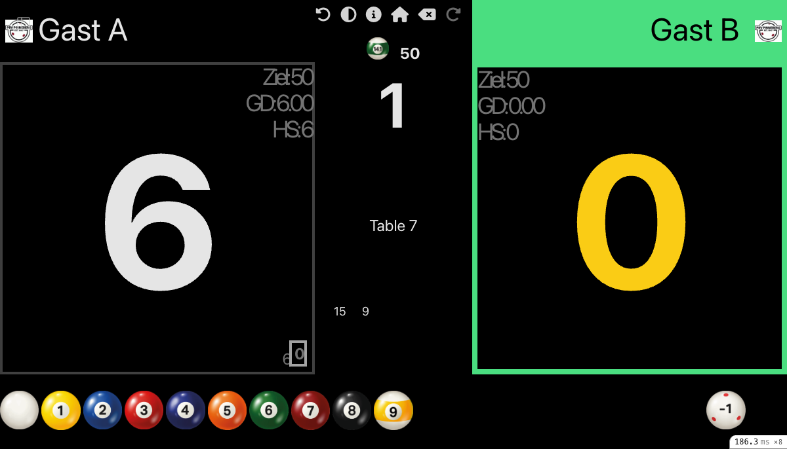
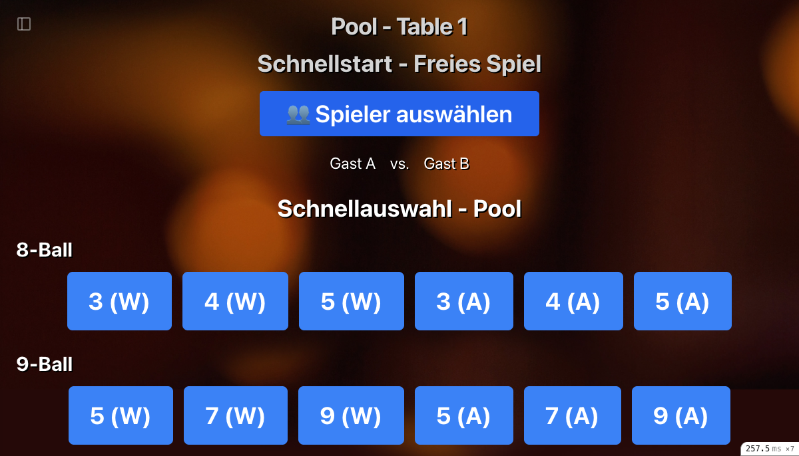

# Pool Scoreboard Benutzerhandbuch

## Übersicht

Das Carambus Pool Scoreboard ist ein vollständiges Anzeigesystem für Pool-Billardspiele, das sowohl für Turniere als auch für Trainingsspiele verwendet werden kann. Es unterstützt alle gängigen Pool-Disziplinen:

- **8-Ball** - Klassisches 8-Ball mit Satz-Zählung
- **9-Ball** - 9-Ball mit Satz-Zählung
- **10-Ball** - 10-Ball mit Satz-Zählung
- **14.1 endlos** - Straight Pool mit Punktezählung

## Hauptfunktionen

- **Spielstandanzeige** - Echtzeit-Anzeige der Punktestände/Sätze beider Spieler
- **Ball-Anzeige** - Visuelle Darstellung der verbleibenden Bälle (14.1 endlos)
- **Aufnahmen-Zähler** - Automatische Zählung der Aufnahmen bei 14.1 endlos
- **Satz-Verwaltung** - Automatische Satzzählung für alle Disziplinen
- **Foul-Tracking** - Erfassung von Fouls mit Punktabzug
- **Dark Mode** - Augenfreundliche Darstellung für verschiedene Lichtverhältnisse

---

## Inhaltsverzeichnis

1. [Erste Schritte](#erste-schritte)
2. [Pool-Disziplinen im Überblick](#pool-disziplinen-im-überblick)
3. [Scoreboard-Hauptansicht](#scoreboard-hauptansicht)
4. [14.1 endlos (Straight Pool)](#141-endlos-straight-pool)
5. [8-Ball, 9-Ball, 10-Ball](#8-ball-9-ball-10-ball)
6. [Spielablauf](#spielablauf)
7. [Tastenbelegung](#tastenbelegung)
8. [Quickstart-Spiele](#quickstart-spiele)
9. [Fehlerbehebung](#fehlerbehebung)

---

## Erste Schritte

### Scoreboard starten

1. **Raspberry Pi Setup**: Das Scoreboard startet automatisch beim Hochfahren des Raspberry Pi
2. **Manueller Start**: Öffnen Sie einen Browser und navigieren zu:
   ```
   http://[server-adresse]:3000/locations/[location-id]/scoreboard?sb_state=welcome
   ```
3. **Von der Location-Seite**: Klicken Sie auf den "scoreboard" Link

### Willkommensbildschirm

Der Willkommensbildschirm ist der Startpunkt für alle Scoreboard-Aktivitäten. Von hier aus können Sie:

- **Turnier auswählen** - Für offizielle Pool-Turniere
- **Tisch auswählen** - Für Trainingsspiele
- **Spielstände anzeigen** - Übersicht laufender Spiele

### Tischübersicht

Nach Auswahl von "Training" erscheint die Tischübersicht mit allen verfügbaren Pool- und Snooker-Tischen:


- **Blaue Buttons**: Freie Tische
- **Spielernamen**: Tische mit laufenden Spielen

---

## Pool-Disziplinen im Überblick

### 8-Ball

Das klassische Pool-Spiel mit 15 Bällen:
- Spieler A: Volle (1-7) oder Halbe (9-15)
- Spieler B: Die andere Gruppe
- Gewonnen wird durch korrektes Versenken der 8

**Scoreboard-Anzeige:** Satzzählung (z.B. "Race to 5")

### 9-Ball

Rotation mit 9 Bällen:
- Bälle müssen in numerischer Reihenfolge angespielt werden
- Gewonnen wird durch Versenken der 9

**Scoreboard-Anzeige:** Satzzählung (z.B. "Race to 7")

### 10-Ball

Ähnlich wie 9-Ball, aber mit 10 Bällen:
- Bälle müssen in numerischer Reihenfolge angespielt werden
- Gewonnen wird durch Versenken der 10
- Ansage erforderlich

**Scoreboard-Anzeige:** Satzzählung (z.B. "Race to 9")

### 14.1 endlos (Straight Pool)

Das anspruchsvollste Pool-Spiel:
- 15 Bälle werden aufgestellt
- Jeder versenkte Ball zählt 1 Punkt
- Bei 1 oder 0 verbleibenden Bällen wird neu aufgestellt (14 Bälle)
- Gespielt wird bis zu einer Zielpunktzahl (z.B. 100, 125, 150)

**Scoreboard-Anzeige:** Punktezählung mit Ball-Anzeige und Aufnahmen-Stack

---

## Scoreboard-Hauptansicht

### Layout für 8-Ball, 9-Ball, 10-Ball

```
┌─────────────────────────────────────────────────────┐
│  [Dark Mode] [Undo] [Redo] [Home] [Beenden]         │
│                                                       │
│  Spieler A                          Spieler B        │
│  ┌─────────────────┐              ┌─────────────────┐│
│  │                 │              │                 ││
│  │      3          │              │      2          ││
│  │                 │              │                 ││
│  │  Race to 5      │              │  Race to 5      ││
│  └─────────────────┘              └─────────────────┘│
│                                                       │
│  [Satz A] [Satz B]                                   │
└─────────────────────────────────────────────────────┘
```

### Layout für 14.1 endlos

```
┌─────────────────────────────────────────────────────┐
│  [Dark Mode] [Undo] [Redo] [Home] [Beenden]         │
│                                                       │
│  Spieler A (aktiv)                  Spieler B        │
│  ┌─────────────────┐              ┌─────────────────┐│
│  │  Aufnahme: 12   │              │  Aufnahme: --   ││
│  │                 │              │                 ││
│  │  Ziel: 100      │              │  Ziel: 100      ││
│  │  GD: 8.50       │              │  GD: 6.20       ││
│  │  HS: 23         │              │  HS: 18         ││
│  │                 │              │                 ││
│  │      67  ←──────│──────────────│───── 52         ││
│  │   (klick=+1)    │              │  (klick=wechsel)││
│  └─────────────────┘              └─────────────────┘│
│                                                       │
│  Aufnahmen-Stack: 15 | 29 | 43 | 57 | 67             │
│                                                       │
│  [0][1][2][3][4][5][6][7][8][9][10][11][12][13][14][15] [F1] [F2] │
└─────────────────────────────────────────────────────┘
```

**Klickbare Bereiche:**
- **Score des aktiven Spielers** (67): Klick = +1 Punkt
- **Score des inaktiven Spielers** (52): Klick = Spielerwechsel

### 14.1 endlos Scoreboard in Aktion


*Spielstart: Beide Spieler bei 0, 15 Bälle auf dem Tisch*


*Während des Spiels: Spieler A (grüner Rahmen) ist aktiv, hat 6 Punkte, 9 Bälle verbleiben*



*Nach Spielerwechsel: Spieler B (grüner Rahmen) ist jetzt aktiv, GD und HS wurden aktualisiert*

### Anzeigeelemente für 14.1 endlos

#### Spielerinformationen (je Seite)

1. **Spielername** - Vollständiger Name oder Kurzname
2. **Aktuelle Aufnahme** - Punkte in der laufenden Aufnahme (rot hervorgehoben)
3. **Ziel** - Zielpunktzahl (z.B. 100, 125, 150)
4. **GD (Generaldurchschnitt)** - Durchschnittliche Punkte pro Aufnahme
5. **HS (Höchstserie)** - Beste Einzelaufnahme im Spiel
6. **Gesamtpunkte** - Großer Punktestand in der Mitte

#### Aufnahmen-Stack

Der Aufnahmen-Stack zeigt die Zwischenstände nach jedem Neuaufbau:
- Jede Zahl repräsentiert den Punktestand nach einem Neuaufbau
- Beispiel: `15 | 29 | 43` bedeutet:
  - Nach dem 1. Neuaufbau: 15 Punkte
  - Nach dem 2. Neuaufbau: 29 Punkte
  - Nach dem 3. Neuaufbau: 43 Punkte

#### Ball-Kontrollleiste (nur 14.1 endlos)

Die untere Leiste zeigt Bälle von 0 bis 15:
- **Klickbare Bälle**: Zeigen die verbleibenden Bälle auf dem Tisch
- **Ball 0 (weiß)** und **Ball 1 (gelb)**: Lösen automatisch einen Neuaufbau aus
- **F1**: Foul (-1 Punkt)
- **F2**: Break-Foul (-2 Punkte, nur bei vollem Tisch)

---

## 14.1 endlos (Straight Pool)

### Spielregeln-Kurzfassung

14.1 endlos ist das klassische Punktespiel im Pool-Billard:

1. **Aufstellung**: 15 Bälle im Dreieck
2. **Ziel**: Eine vorher festgelegte Punktzahl erreichen (typisch: 100, 125, 150)
3. **Punkte**: Jeder korrekt versenkte Ball = 1 Punkt
4. **Neuaufbau**: Bei 1 oder 0 verbleibenden Bällen werden 14 Bälle neu aufgestellt
5. **Fouls**: -1 Punkt pro Foul, bei 3 Fouls in Folge: -15 Punkte

### Bedienung des Scoreboards

#### Punkte eintragen

**Methode 1: Ball-Klick (empfohlen für mehrere Bälle)**

Klicken Sie auf den Ball, der der Anzahl der **verbleibenden** Bälle auf dem Tisch entspricht:

- Beispiel: 12 Bälle auf dem Tisch → Klick auf Ball "12"
- Das System berechnet automatisch die versenkten Bälle

**Methode 2: Klick auf den eigenen Score (+1 Punkt)**

Für einzelne Punkte können Sie direkt auf den **Punktestand des aktiven Spielers** klicken:

- Klicken Sie auf die große Punktzahl des aktiven Spielers
- Jeder Klick fügt **+1 Punkt** hinzu
- Ideal für schnelle Einzelpunkt-Eingaben

**Methode 3: Direkte Eingabe**

Für größere Serien können Sie auch die Zahlen-Eingabe verwenden.

#### Spielerwechsel

**Methode 1: Klick auf den Score des anderen Spielers**

Der einfachste Weg zum Spielerwechsel:

- Klicken Sie auf die **Punktzahl des nicht-aktiven Spielers**
- Der Spieler wechselt sofort
- Die aktuelle Aufnahme wird abgeschlossen
- Der grüne Rahmen wechselt zum neuen aktiven Spieler

**Methode 2: Automatischer Wechsel**

Nach einer Aufnahme ohne Erfolg:
- Der aktive Spieler wechselt automatisch
- Der grüne Rahmen zeigt den neuen aktiven Spieler

> **Tipp:** Der Klick auf den gegnerischen Score ist die schnellste Methode für den Spielerwechsel und wird von erfahrenen Schiedsrichtern bevorzugt.

#### Neuaufbau (Rerack)

Wenn Sie auf **Ball 1** oder **Ball 0** klicken:
1. Die versenkten Bälle werden gezählt
2. Der Aufnahmen-Stack wird aktualisiert
3. Der Ball-Zähler springt auf 15 (bzw. 14 + verbleibender Ball)

**Ball 1 (gelb)**: 14 Bälle versenkt, 1 Ball bleibt liegen
**Ball 0 (weiß)**: Alle 15 Bälle versenkt (Break-and-Run zum Neuaufbau)

#### Fouls

**F1 - Einfaches Foul (-1 Punkt)**
- Klicken Sie auf den **F1**-Button
- Der Spieler erhält -1 Punkt
- Ein Foul-Marker erscheint
- Bei 3 Fouls in Folge: Automatisch -15 Punkte zusätzlich

**F2 - Break-Foul (-2 Punkte)**
- Nur aktiv bei vollem Tisch (15 Bälle)
- Typisch für misslungene Eröffnungsstöße
- Klicken Sie auf den **F2**-Button

### Beispiel-Spielablauf 14.1 endlos

1. **Start**: Beide Spieler haben 0 Punkte, 15 Bälle auf dem Tisch
2. **Spieler A** versenkt 5 Bälle → Klick auf Ball "10" (10 Bälle übrig)
3. **Spieler A** versenkt weitere 4 Bälle → Klick auf Ball "6" (6 Bälle übrig)
4. **Spieler A** versenkt weitere 5 Bälle → Klick auf Ball "1" (Neuaufbau!)
   - Stack zeigt: `14`
   - Ball-Zähler: 15
5. **Spieler A** verschießt → Klick auf **Score von Spieler B** → Spielerwechsel
6. **Spieler B** versenkt 1 Ball → Klick auf **eigenen Score** (+1 Punkt)
7. **Spieler B** versenkt noch 1 Ball → Klick auf **eigenen Score** (+1 Punkt)
8. **Spieler B** verschießt → Klick auf **Score von Spieler A** → Spielerwechsel
9. Usw.

### Eingabe-Zusammenfassung

| Aktion | Eingabe |
|--------|---------|
| **+1 Punkt** | Klick auf eigenen Score |
| **+X Punkte** | Klick auf Ball mit verbleibender Anzahl |
| **Spielerwechsel** | Klick auf gegnerischen Score |
| **Foul (-1)** | Klick auf F1 |
| **Break-Foul (-2)** | Klick auf F2 (nur bei 15 Bällen) |
| **Neuaufbau** | Klick auf Ball 0 oder 1 |

---

## 8-Ball, 9-Ball, 10-Ball

### Bedienung des Scoreboards

Bei diesen Disziplinen wird in Sätzen gespielt (z.B. "Race to 5").

#### Satz gewinnen

Klicken Sie auf den entsprechenden Button:
- **Satz A**: Spieler A gewinnt den Satz
- **Satz B**: Spieler B gewinnt den Satz

#### Match-Ende

Das Spiel endet automatisch, wenn ein Spieler die erforderliche Anzahl von Sätzen gewonnen hat.

### Beispiel: 9-Ball Race to 5

1. **Start**: 0:0
2. Spieler A gewinnt Rack 1 → Klick "Satz A" → 1:0
3. Spieler B gewinnt Rack 2 → Klick "Satz B" → 1:1
4. ... (weitere Racks)
5. Spieler A erreicht 5 Sätze → Match gewonnen!

---

## Spielablauf

### 1. Tisch auswählen

1. Vom **Willkommensbildschirm** wählen Sie **"Tische"**
2. Wählen Sie einen **Pool-Tisch** (erkennbar am Tischtyp)
3. Klicken Sie auf den gewünschten Tisch

### 2. Spielform wählen

Nach Auswahl des Tisches erscheinen die Pool-Optionen:

**Quickstart-Buttons:**
- **8-Ball Race to 3/5/7**
- **9-Ball Race to 5/7/9**
- **10-Ball Race to 5/7/9**
- **14.1 endlos 50/75/100/125/150**

**Oder:** Detaillierte Konfiguration über "Neue Pool-Partie"

### 3. Spieler auswählen

1. Klicken Sie auf **"Spieler A"**
2. Wählen Sie den Spieler aus der Liste
3. Wiederholen Sie für **"Spieler B"**

### 4. Ausstoßen (Lag)

Bestimmen Sie, wer das Spiel beginnt:
1. Beide Spieler stoßen vom Kopfende
2. Wählen Sie den Gewinner:
   - **"Spieler A"**: Spieler A gewinnt das Lag
   - **"Spieler B"**: Spieler B gewinnt das Lag
3. **Spiel starten**

### 5. Spiel läuft

Je nach Disziplin:
- **14.1 endlos**: Ball-Klicks für Punkteingabe
- **8/9/10-Ball**: Satz-Buttons für Satzgewinne

### 6. Spielende

- **14.1 endlos**: Wenn ein Spieler die Zielpunktzahl erreicht
- **8/9/10-Ball**: Wenn ein Spieler die erforderlichen Sätze gewinnt

---

## Tastenbelegung

### Haupttasten

| Taste | Funktion | Beschreibung |
|-------|----------|--------------|
| **Pfeil Links** | Spieler A | Satz für Spieler A (8/9/10-Ball) |
| **Pfeil Rechts** | Spieler B | Satz für Spieler B (8/9/10-Ball) |
| **Pfeil Oben** | Navigation | Nächstes Element |
| **Pfeil Unten** | Aktion | Element aktivieren |
| **B** | Zurück/Weiter | Navigation |
| **Esc** | Zurück | Zum vorherigen Bildschirm |
| **Enter** | Bestätigen | Auswahl bestätigen |

### Spezielle Tasten

| Taste | Funktion |
|-------|----------|
| **F5** | Seite neu laden |
| **F11** | Vollbildmodus |
| **F12** | Scoreboard beenden |

---

## Quickstart-Spiele

### Pool-Presets



*Schnellauswahl für Pool-Spiele: 8-Ball, 9-Ball, 10-Ball und 14.1 endlos*

Für schnelles Starten ohne viele Einstellungen:

#### 8-Ball
- **8-Ball Race to 3** - Kurzes Match
- **8-Ball Race to 5** - Standard-Match
- **8-Ball Race to 7** - Langes Match

#### 9-Ball
- **9-Ball Race to 5** - Kurzes Match
- **9-Ball Race to 7** - Standard-Match
- **9-Ball Race to 9** - Langes Match

#### 10-Ball
- **10-Ball Race to 5** - Kurzes Match
- **10-Ball Race to 7** - Standard-Match
- **10-Ball Race to 9** - Langes Match

#### 14.1 endlos
- **14.1 endlos 50** - Kurzes Spiel (Training)
- **14.1 endlos 75** - Mittleres Spiel
- **14.1 endlos 100** - Standard-Match
- **14.1 endlos 125** - Langes Match
- **14.1 endlos 150** - Turnier-Standard

### Quickstart verwenden

1. Tisch auswählen
2. Auf den gewünschten Quickstart-Button klicken
3. Spieler A und B auswählen
4. **Spiel starten**

---

## Menü und Navigation

### Hauptmenü-Icons

| Icon | Funktion | Beschreibung |
|------|----------|--------------|
| 🌓 | Dark Mode | Hell/Dunkel-Modus umschalten |
| ↩️ | Undo | Letzte Aktion rückgängig machen |
| ↪️ | Redo | Rückgängig gemachte Aktion wiederherstellen |
| 🏠 | Home | Zurück zum Willkommensbildschirm |
| ⌫ | Beenden | Spiel beenden (mit Bestätigung) |

### Undo/Redo

Bei Eingabefehlern:
1. Klicken Sie auf **Undo** (↩️) um die letzte Aktion rückgängig zu machen
2. Klicken Sie auf **Redo** (↪️) um sie wiederherzustellen

---

## Fehlerbehebung

### Ball-Anzeige aktualisiert sich nicht (14.1 endlos)

**Lösung:**
1. Drücken Sie **F5** um die Seite neu zu laden
2. Der korrekte Spielstand wird wiederhergestellt

### Punkte werden nicht gespeichert

**Ursache:** Netzwerkverbindung unterbrochen

**Lösung:**
1. Überprüfen Sie die Netzwerkverbindung
2. Laden Sie die Seite neu (F5)
3. Bei längerer Unterbrechung: Notieren Sie den Stand manuell

### Falscher Spieler aktiv

**Lösung:**
1. Verwenden Sie **Undo** um zur korrekten Position zurückzukehren
2. Oder: Beenden Sie das Spiel und starten Sie neu

### Foul-Zähler falsch

**Lösung:**
1. Bei 14.1 endlos: Verwenden Sie **Undo** mehrfach
2. Die Foul-Marker werden automatisch korrigiert

### Scoreboard reagiert nicht

**Lösung:**
1. Drücken Sie **F5** um die Seite neu zu laden
2. Falls das nicht hilft: Browser schließen und neu starten
3. Im Notfall: Raspberry Pi neu starten

---

## Unterschiede: Pool vs. Karambol

| Aspekt | Pool | Karambol |
|--------|------|----------|
| **Punktezählung** | Bälle/Sätze | Karambolagen |
| **Eingabe** | Ball-Klicks / Satz-Buttons | Zahlen-Eingabe |
| **Neuaufbau** | Bei 0-1 Bällen (14.1) | Nicht relevant |
| **Fouls** | -1/-2 Punkte (14.1) | Kein Punktabzug |
| **Timer** | Selten verwendet | Häufig verwendet |
| **Aufnahmen** | Gezählt (14.1) | Immer gezählt |

---

## Glossar

| Begriff | Erklärung |
|---------|-----------|
| **Break** | Eröffnungsstoß |
| **Rack** | Ein Satz/Frame bei 8/9/10-Ball |
| **Rerack/Neuaufbau** | Neues Aufstellen der Bälle bei 14.1 |
| **Lag** | Ausstoßen zur Bestimmung des Anstoßrechts |
| **Race to X** | Wer zuerst X Sätze gewinnt |
| **Run** | Serie von versenkten Bällen ohne Fehler |
| **Safety** | Sicherheitsstoß |
| **Foul** | Regelverstoß mit Strafpunkten |
| **GD** | Generaldurchschnitt (Punkte pro Aufnahme) |
| **HS** | Höchstserie (beste Aufnahme im Spiel) |

---

## Support und Hilfe

Bei Problemen oder Fragen:

1. **Dokumentation**: Lesen Sie diese Anleitung gründlich
2. **Administrator kontaktieren**: Ihr Club-Administrator kann helfen
3. **GitHub Issues**: [https://github.com/GernotUllrich/carambus/issues](https://github.com/GernotUllrich/carambus/issues)

---

## Version

Dieses Handbuch gilt für Carambus Version 2.0 und höher.

Letzte Aktualisierung: Dezember 2025

