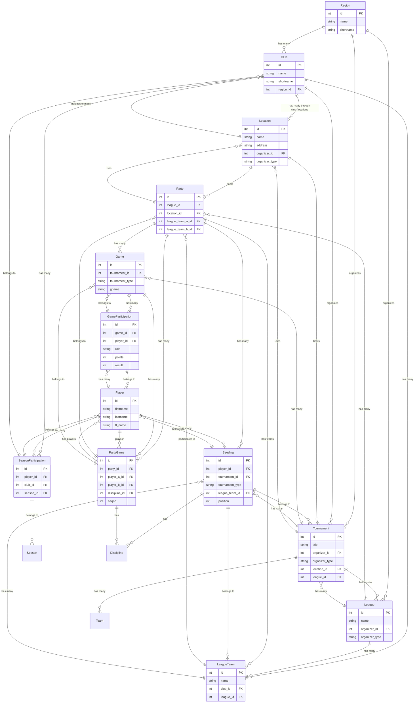

```mermaid
erDiagram
    Region ||--o{ Club : "has many"
    Region ||--o{ Tournament : "organizes"
    Region ||--o{ League : "organizes"
    
    Club ||--o{ Location : "has many through club_locations"
    Club ||--o{ LeagueTeam : "has many"
    Club ||--o{ Tournament : "organizes"
    Club ||--o{ SeasonParticipation : "has many"
    
    Tournament ||--o{ Game : "has many"
    Tournament ||--o{ Seeding : "has many"
    Tournament ||--o{ Team : "has many"
    Tournament ||--o{ Location : "uses"
    Tournament ||--o{ League : "belongs to"
    
    League ||--o{ LeagueTeam : "has many"
    League ||--o{ Party : "has many"
    League ||--o{ Tournament : "has many"
    
    Party ||--o{ Game : "has many"
    Party ||--o{ PartyGame : "has many"
    Party ||--o{ Seeding : "has many"
    Party ||--o{ Location : "uses"
    Party ||--o{ LeagueTeam : "has teams"
    
    Location ||--o{ Party : "hosts"
    Location ||--o{ Tournament : "hosts"
    Location ||--o{ Club : "belongs to many"
    
    LeagueTeam ||--o{ Party : "participates in"
    LeagueTeam ||--o{ Seeding : "has many"
    
    Game ||--o{ GameParticipation : "has many"
    Game ||--o{ PartyGame : "has many"
    
    Player ||--o{ GameParticipation : "has many"
    Player ||--o{ SeasonParticipation : "has many"
    Player ||--o{ Seeding : "has many"
    Player ||--o{ PartyGame : "plays in"
    
    SeasonParticipation ||--o{ Player : "belongs to"
    SeasonParticipation ||--o{ Club : "belongs to"
    SeasonParticipation ||--o{ Season : "belongs to"
    
    Seeding ||--o{ Player : "belongs to"
    Seeding ||--o{ Tournament : "belongs to"
    Seeding ||--o{ LeagueTeam : "belongs to"
    Seeding ||--o{ Discipline : "has"

    PartyGame ||--o{ Party : "belongs to"
    PartyGame ||--o{ Player : "has players"
    PartyGame ||--o{ Discipline : "has"
    PartyGame ||--o{ Game : "belongs to"

    GameParticipation ||--o{ Game : "belongs to"
    GameParticipation ||--o{ Player : "belongs to"

    %% Entity definitions with their key attributes
    Region {
        int id PK
        string name
        string shortname
    }

    Club {
        int id PK
        string name
        string shortname
        int region_id FK
    }

    Tournament {
        int id PK
        string title
        int organizer_id FK
        string organizer_type
        int location_id FK
        int league_id FK
    }

    League {
        int id PK
        string name
        int organizer_id FK
        string organizer_type
    }

    Party {
        int id PK
        int league_id FK
        int location_id FK
        int league_team_a_id FK
        int league_team_b_id FK
    }

    Location {
        int id PK
        string name
        string address
        int organizer_id FK
        string organizer_type
    }

    LeagueTeam {
        int id PK
        string name
        int club_id FK
        int league_id FK
    }

    Game {
        int id PK
        int tournament_id FK
        string tournament_type
        string gname
    }

    Player {
        int id PK
        string firstname
        string lastname
        string fl_name
    }

    SeasonParticipation {
        int id PK
        int player_id FK
        int club_id FK
        int season_id FK
    }

    Seeding {
        int id PK
        int player_id FK
        int tournament_id FK
        string tournament_type
        int league_team_id FK
        int position
    }

    PartyGame {
        int id PK
        int party_id FK
        int player_a_id FK
        int player_b_id FK
        int discipline_id FK
        int seqno
    }

    GameParticipation {
        int id PK
        int game_id FK
        int player_id FK
        string role
        int points
        int result
    }
``` 